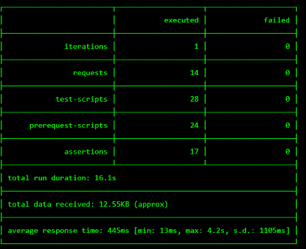

How to Deploy a Solution
==========================

To access your dedicated lab environment, you will require a web browser
and Remote Desktop Protocol (RDP) client software. The web browser will be used to
access the Lab Environment. The RDP client will be used to connect to the Jump
Host, where you will be able to access the BIG-IP management interfaces (HTTPS, SSH).

1. Establish a RDP connection to **jumphost.f5lab.local**  with the following credentials:

:Username: **f5lab\\user1**
:Password: **user1**

2. On logon the Chrome browser should auto launch and open the site https://portal.f5lab.local

|image17|

3. Hover over the solution you would like to deploy. A start and stop icon should appear under a single Data Center(DC) deployment option.  If the automation supports a multi-datacenter deployment option a second set of icon will also be displayed.

|image18|

.. note:: While multiple solutions can normally be deployed, solutions involving a IDaaS must be restricted to a single deployment at a time.  That is eliminates the configuration changes required on the IDaaS by having  SAML applications resolve to sp.acme.com and OAuth applications resolve to rs.acme.com.

 4. Click the **play** button under the deployment option you wish the automation to configure.  Scroll to the bottom of the automation workflow to ensure all requests succeeded.  If you you experience errors try running the automation a second time or open an issue on the **access-solutions** repo.

.. note::  Wait 15 seconds and the screen should refresh with the automation status

|image19|

5. The accompanying solution guide will provide details on how to access the application
   that was just deployed.

6. Once you are done working in that solution return to https://portal.f5lab.local and click the **stop** to delete everything related to that solution

|image20|

.. note: All work for this lab will be performed exclusively from the provided lab environment.
      No installation or interaction with your local system is required.

.. |image17| image:: media/017.png
.. |image18| image:: media/018.png

.. |image20| image:: media/020.png
