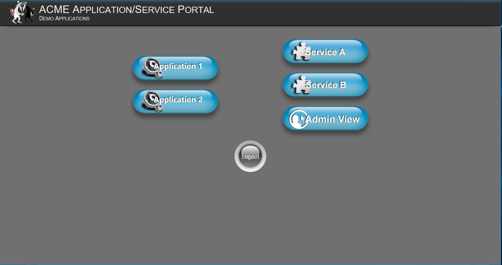
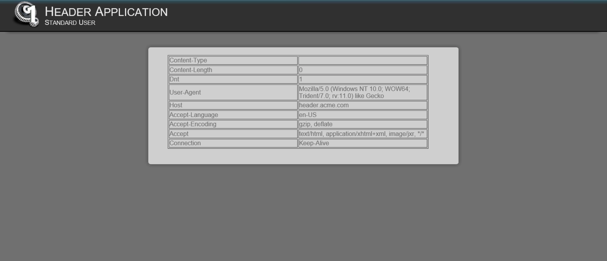
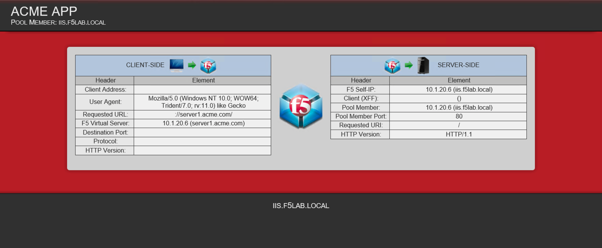

Websites hosted in the environment
-------------------------------------

The websites for this blueprint are currently hosted in three locations.  The IIS VM, Centos VM, or as a container.  All sites must be accessed using its FDQN and not the IP address.  Sites can also be created dynamically using the APIs.

IIS
~~~~~~~~

app.acme.com
^^^^^^^^^^^^^^^

 - Authentication method: Anonymous
 - IP Address: 10.1.20.6

|image3|

basic.acme.com
^^^^^^^^^^^^^^^

 - Authentication method: Basic
 - IP Address: 10.1.20.6

|image4|

header.acme.com
^^^^^^^^^^^^^^^^^^

 - Authentication method: Anonymous
 - IP Address: 10.1.20.6

|image5|

Kerb.acme.com
^^^^^^^^^^^^^^^^

 - Authentication method: Kerberos
 - IP Address: 10.1.20.16

|image6|

mTLS.acme.com 
^^^^^^^^^^^^^^^^^^^^^^^^^

 - Authentication method: Mutual TLS
 - IP Address: 10.1.20.6

|image7|

ntlm.acme.com -untested
^^^^^^^^^^^^^^^^^^^^^^^^^

 - Authentication method: NTLM
 - IP Address: 10.1.20.6

|image8|

portal.acme.com 
^^^^^^^^^^^^^^^^^^^^^^^^^^^^^

 - Authentication method: - Local Database(NonAD) Forms
 - IP Address: 10.1.20.6

|image9|

server1.acme.com 
^^^^^^^^^^^^^^^^^^^^^^^^^^^^^

 - Authentication method: - Anonymous
 - IP Address: 10.1.20.6

|image10|

server2.acme.com 
^^^^^^^^^^^^^^^^^^^^^^^^^^^^^

 - Authentication method: - Anonymous
 - IP Address: 10.1.20.6

|image11|

server3.acme.com 
^^^^^^^^^^^^^^^^^^^^^^^^^^^^^

 - Authentication method: - Anonymous
 - IP Address: 10.1.20.6

|image12|

server4.acme.com 
^^^^^^^^^^^^^^^^^^^^^^^^^^^^^

 - Authentication method: - Anonymous
 - IP Address: 10.1.20.6

|image13|

Unprotected-json.f5lab.local 
^^^^^^^^^^^^^^^^^^^^^^^^^^^^^

 - Authentication method: - Anonymous
 - IP Address: 10.1.20.6

|image14|

NGINX
~~~~~~~~

files-dev.f5lab.local
^^^^^^^^^^^^^^^^^^^^^^^^^

 - Authentication method: - Anonymous
 - IP Address: 10.1.20.9

|image15|

files-master.f5lab.local
^^^^^^^^^^^^^^^^^^^^^^^^^^^

 - Authentication method: - Anonymous
 - IP Address: 10.1.20.9

|image15|

mtls.acme.com
^^^^^^^^^^^^^^^^^

 - Authentication method: - Mutual TLS
 - IP Address: 10.1.20.9

|image16|

.. |image4| image:: media/004.png

.. |image6| image:: media/006.png
.. |image7| image:: media/007.png
.. |image8| image:: media/008.png
.. |image9| image:: media/009.png

.. |image11| image:: media/011.png
.. |image12| image:: media/012.png
.. |image13| image:: media/013.png
.. |image14| image:: media/014.png
.. |image15| image:: media/015.png
.. |image16| image:: media/016.png
