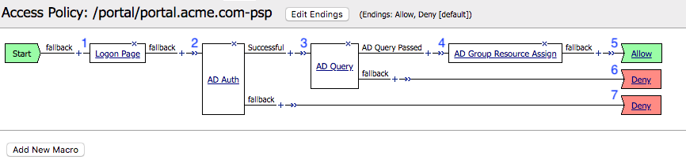
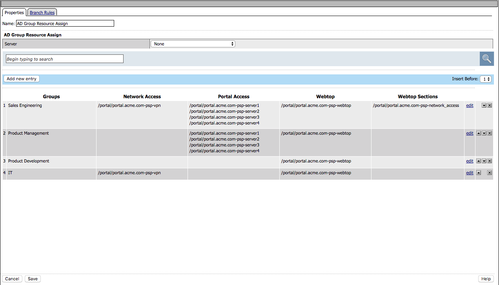
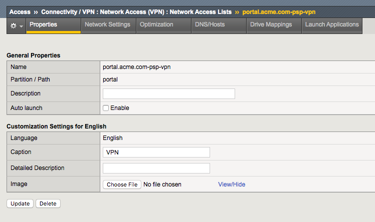
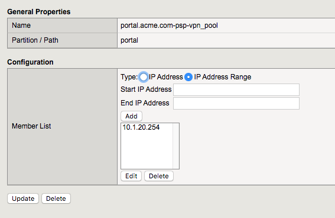
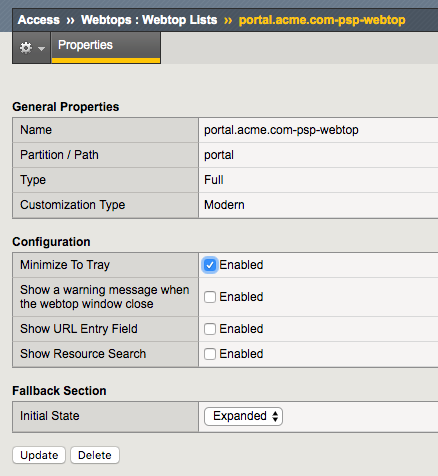
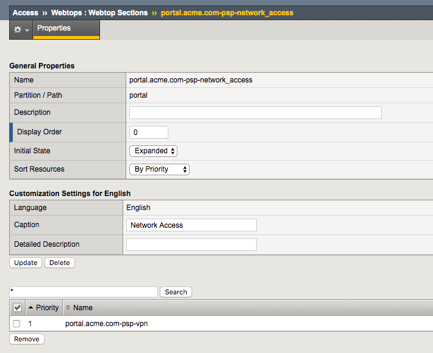
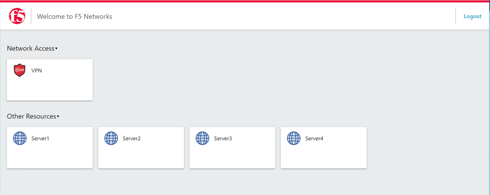
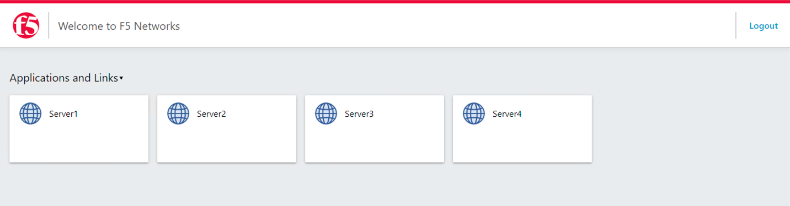

The Policy
======================================================

Policy Walk-Through
----------------------

|image1|

#.  A user enters their credentials in the logon page agent.
    - Those credentials are collected, then stored as the default system session variables of session.logon.last.username and session.logon.last.password.
    - The user proceeds down the logon page fallback branch to the AD Auth Agent

#.  The AD Auth Agent validates the username and password session variables against the configured AD Domain Controller.
#.  If AD Authentication is successful, the user proceeds down the Successful Branch
    - The AD Query Agent connects to the AD Server to retrieve user attributes (Specifically memberOf)

#.  If the query succeeds, the user is assigned resourced defined in the AD Group Resource Assign
#.  The user is granted access via the Allow Terminal
#.  If the AD query fails,  the user is denied access via the Deny Terminal
#.  If AD Authentication is unsuccessful, the user proceeds down the fallback branch to the Deny Terminal

Policy Agent Configuration
----------------------------

The Logon Page contains only the default setting

|image2|

The AD Auth agent defines the AAA AD Servers that a user will be authenticated against.  All Setting are the default.

|image3|

The AD Query Agent uses the default settings to look for a sAMAccountName that matches  the session variable session.logon.last.username.

|image4|

If a match is found the attributes specified in the **Required Attributes** section are requested by APM and are returned by Active Directory

|image5|

The AD Group Resource Assign Agent grants user's access to resources according to their groups.

.. note:  Resource assignment is cumulative if a user is a member of more than one group.

|image6|

Supporting APM Objects
-----------------------

Network Access Resource
^^^^^^^^^^^^^^^^^^^^^^^^

The Properties page contains the Caption name **VPN**.  This is the name displayed to a user

|image7|

- The Network Settings tab assigns the **lease pool** of ip addresses that will be used for the VPN
- Split Tunneling is configured to permit only the **10.1.20.0/24** subnet range inside the VPN

|image8|

Lease Pool
^^^^^^^^^^^^
A single address of **10.1.20.254** is assigned inside the lease pool.

|image9|

Webtop
^^^^^^^^^^^
- A Full Webtop was defined with modified default settings.
- The Minimize to Tray box is **checked** to ensure the Webtop is not displayed when a user connects to the VPN.

|image10|

Webtop Sections
^^^^^^^^^^^^^^^^
A single section is configured to display a custom name.

|image11|

Portal Access Resources
^^^^^^^^^^^^^^^^^^^^^^^^^^

- The **Application URI** field contains the URL of the resource

|image12|

- Destination field contains the hostname of the application
- Path is set to /* for all paths
- The port is set to 443

|image13|

The Policy from a user's perspective
-------------------------------------

User1
^^^^^^

#.  User1 is presented a logon page to collect AD credentials

|image14|

#.  User1 is presented resources based on their **Sales Engineering** group membership

|image15|

User2
^^^^^^

#.  User2 is presented a logon page to collect AD Credentials

|image16|

#.  User2 is presented resources based on the **Product Management** group membership

|image17|

.. |image2| image:: media/002.png
.. |image3| image:: media/003.png
.. |image4| image:: media/004.png
.. |image5| image:: media/005.png

.. |image8| image:: media/008.png

.. |image12| image:: media/012.png
.. |image13| image:: media/013.png
.. |image14| image:: media/014.png

.. |image16| image:: media/016.png

