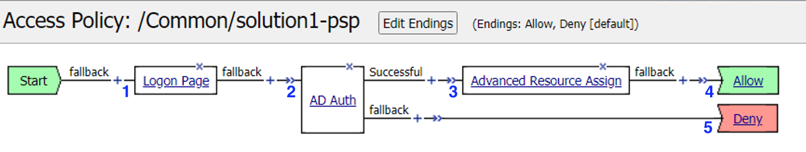
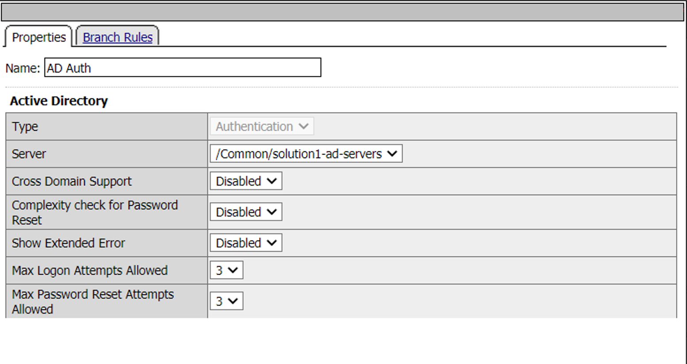
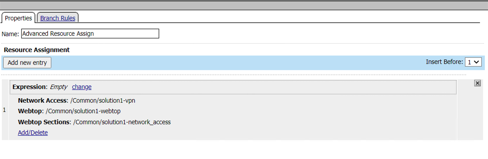
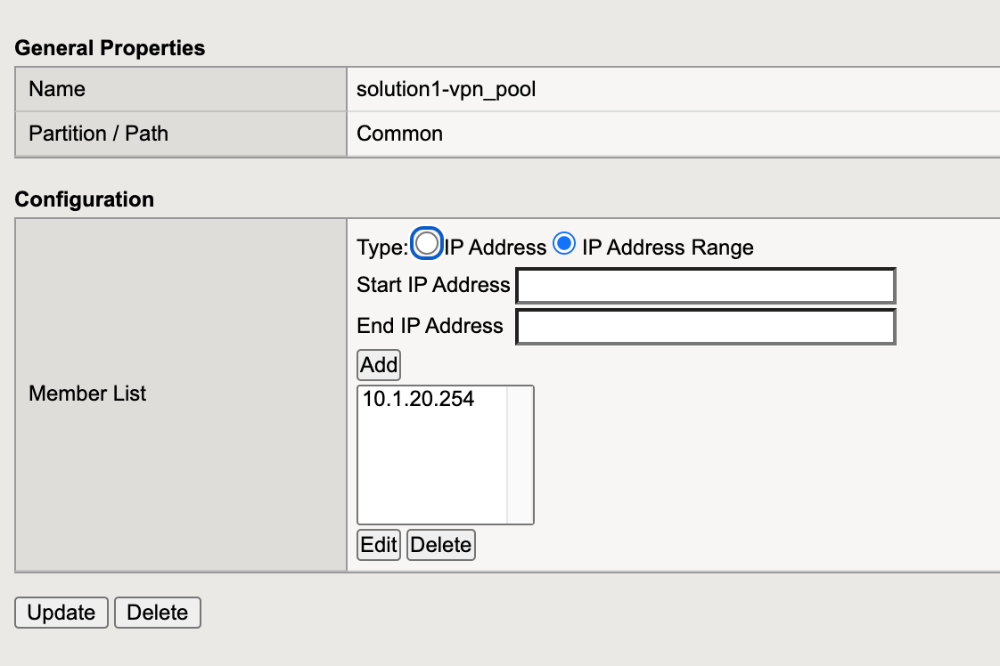

The Policy
======================================================

Policy Walk-Through
----------------------

|image1|     

1. A user enters their credentials into the logon page agent.  
    - Those credentials are collected, stored as the default system session variables of session.logon.last.username and session.logon.last.password.                                
          

2. The AD Auth Agent validates the username and password session variables against the configured AD Domain Controller.
3. The user is assigned resources defined in the Advanced Resource Assign Agent
4. The user is granted access via the Allow Terminal
5. If unsuccessful, the user proceeds down the fallback branch and denied access via the Deny Terminal
                                                                                                    

Policy Agent Configuration
----------------------------

The Logon Page contains only the default setting                                                                          

|image2|                                                                                   

The AD Auth agent defines the AAA AD Servers that a user will be authenticated against.  All Setting are the default.

|image3|                                                                                   

The Advanced Resource Assign agent grants a user access to the assigned resources.                                     

|image4|                                                                              

Supporting APM Objects
-----------------------

Network Access Resource
^^^^^^^^^^^^^^^^^^^^^^^^

The Properties page contains the Caption name **VPN**.  This is the name displayed to a user.                            

|image4|                                                                                   

- The Network Settings tab assigns the **lease pool** of ip addresses that will be used for the VPN.                         
- Split Tunneling is configured to permit only the **10.1.20.0/24** subnet range inside the VPN.                            
|image6|                                                                                   

Lease Pool
^^^^^^^^^^^^
A single address of **10.1.20.254** is assigned inside the lease pool.                                                    

|image7|                                                                                   

Webtop Sections
^^^^^^^^^^^^^^^^
A single section is configured to display a custom name.                                                                  

|image8|                                                                                   

Webtop
^^^^^^^^^^^
- A Full Webtop was defined with modified default settings.                                  
- The Minimize to Tray box is **checked** to ensure the Webtop is not displayed when a user connects to the VPN.               

|image9|   

                                                                              

The Policy from a user's perspective
-------------------------------------

#. The connects to https://solution1.acme.com with the following credentials

   - Username: user1
   - Password: user1

   |image10|

#. Once authenticated the user is presented a Webtop with a single VPN icon.

   |image11|

#.   Assuming the VPN has already been installed the user is notified that the client is attempting to start

  |image12|

#.  A popup opens displaying the status of the VPN connection.  The status will eventually become **Connected**

  |image13|

.. |image2| image:: media/002.png

.. |image5| image:: media/005.png
.. |image6| image:: media/006.png

.. |image8| image:: media/008.png
.. |image9| image:: media/009.png
.. |image10| image:: media/010.png
.. |image11| image:: media/011.png
.. |image12| image:: media/012.png
.. |image13| image:: media/013.png
   

