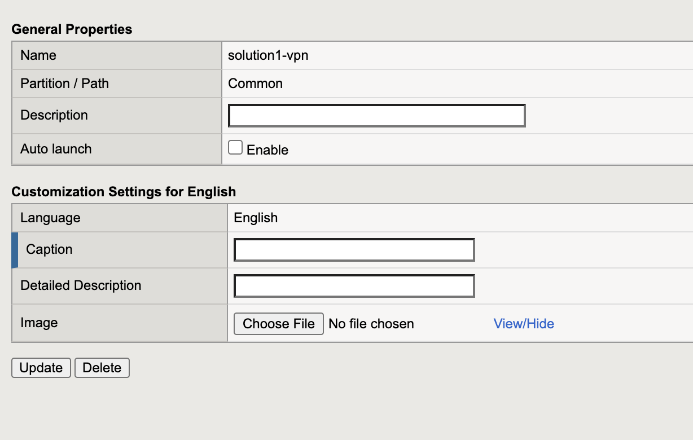
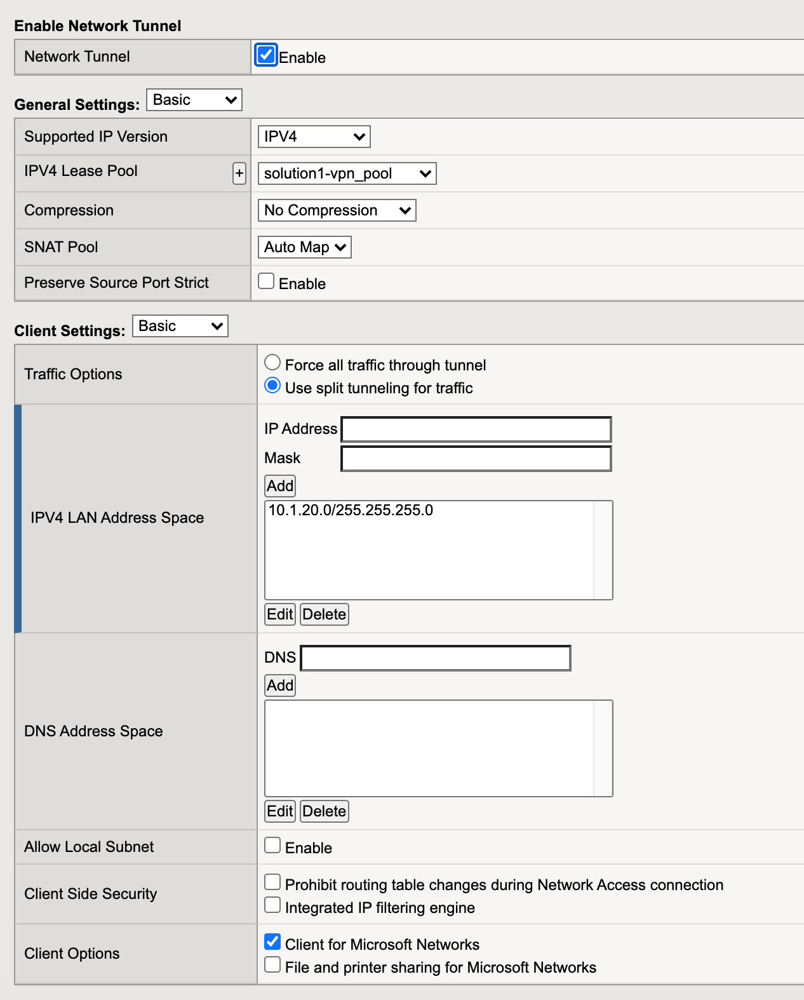
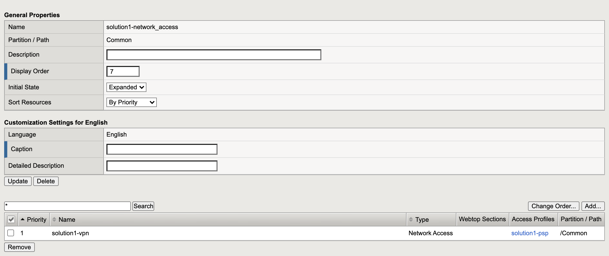
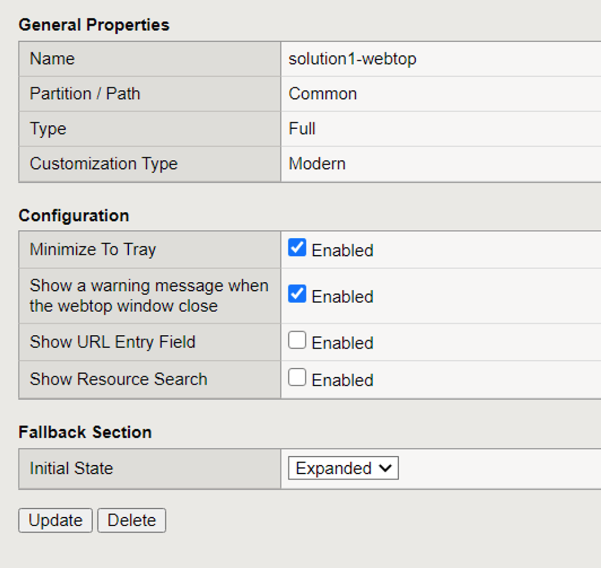

The Policy
======================================================

Policy Walk-Through
----------------------

|image001|     

1. In this policy a user enters their credentials in the logon page agent.  
    - Those credentials are collected, stored as the default system session variables of session.logon.last.username and session.logon.last.password.                                
          
2. The AD Auth Agent validates the the username and password session variables against the configured AD Domain Controller.
3. The user is assigned resourced defined in the Advanced Resource Assign Agent
4. The user is granted access via the Allow Terminal
5. If unsuccessful, the user proceeds down the fallback branch and denied access via the Deny Terminal
                                       

                                                                                

Policy Agent Configuration
----------------------------

The Logon Page contains only the default setting                                                                          

|image002|                                                                                   

The AD Auth Agent uses a defined the  AD AAA Server object that user will be authenticated against.  All Setting are the default.

|image003|                                                                                   

The Advanced resource Assign Agent grants a user access to assigned in the screenshot                                     

|image004|                                                                                   

Supporting APM Objects
-----------------------

Network Access Resource
^^^^^^^^^^^^^^^^^^^^^^^^

The Properties page contains the Caption name **VPN**.  This is the name displayed to a user                            

|image005|                                                                                   

- The Network Settings tab assigns the **lease pool** of ip addresses that will be used for the VPN                         
- Split Tunneling is configured to permit only the **10.1.20.0/24 subnet range inside the VPN                            
|image006|                                                                                   

Lease Pool
^^^^^^^^^^^^
A single address of **10.1.20.254** is assigned inside the lease pool.                                                    

|image007|                                                                                   

Webtop Sections
^^^^^^^^^^^^^^^^
A single section is configured to display a custom name.                                                                  

|image008|                                                                                   

Webtop
^^^^^^^^^^^
- A Full Webtop was defined with modified default settings.                                  
- The Minimize to Tray box was checked to ensure when a user connects to the VPN the Webtop is not displayed               

|image009|                                                                                   

The Policy from a user's perspective
-------------------------------------

.. |image001| image:: media/001.png
.. |image002| image:: media/002.png
.. |image003| image:: media/003.png
.. |image004| image:: media/004.png

.. |image007| image:: media/007.png

   

