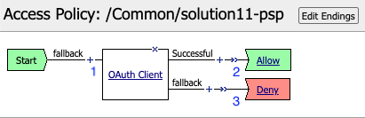
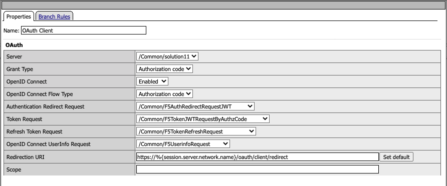
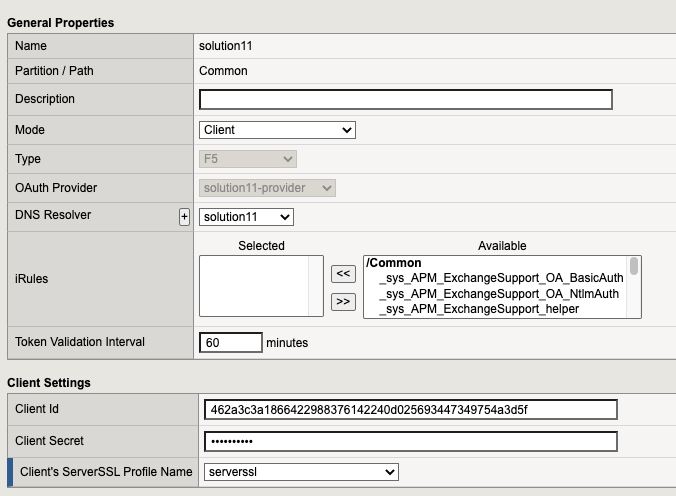
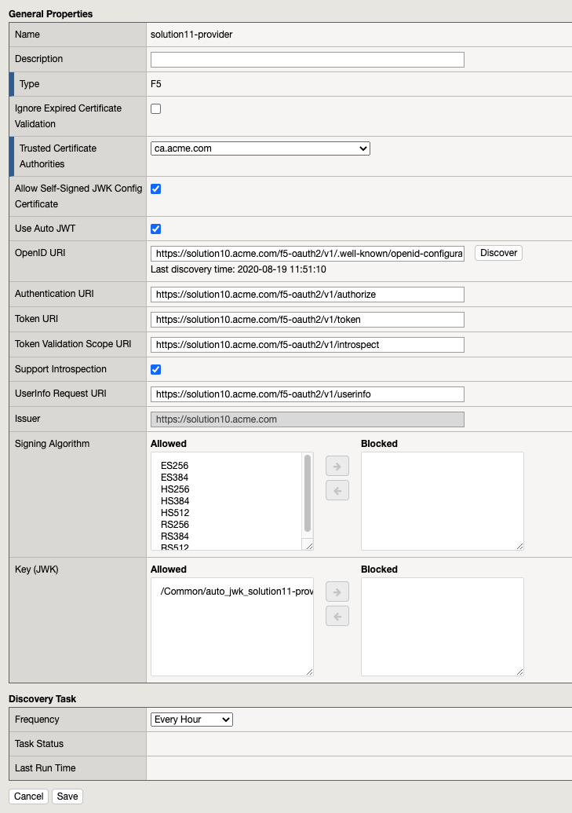
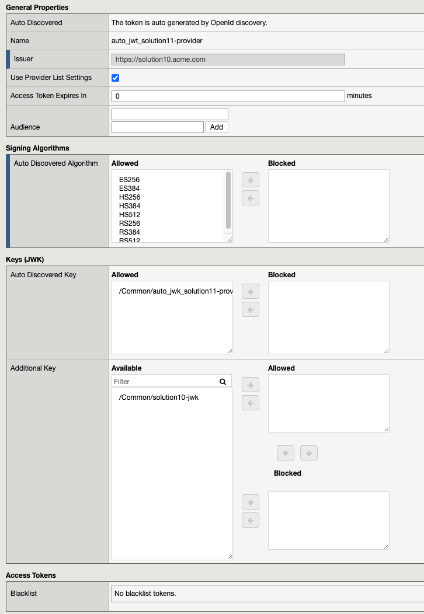
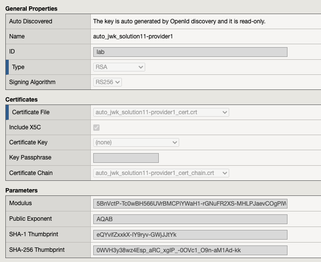
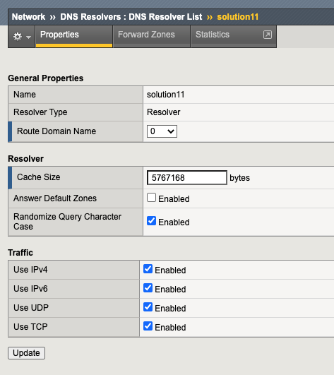
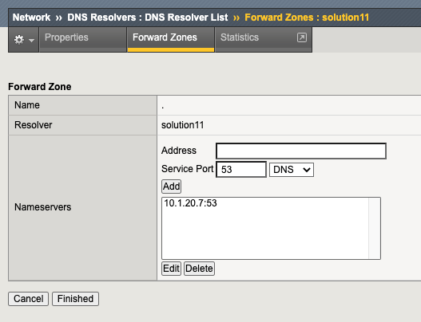
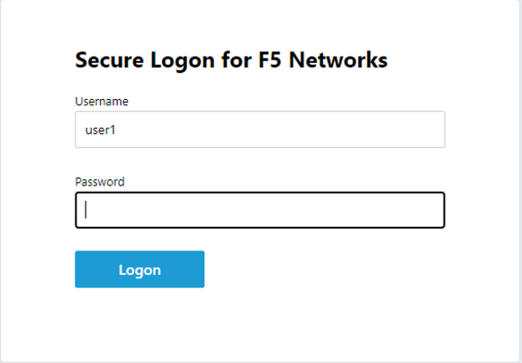
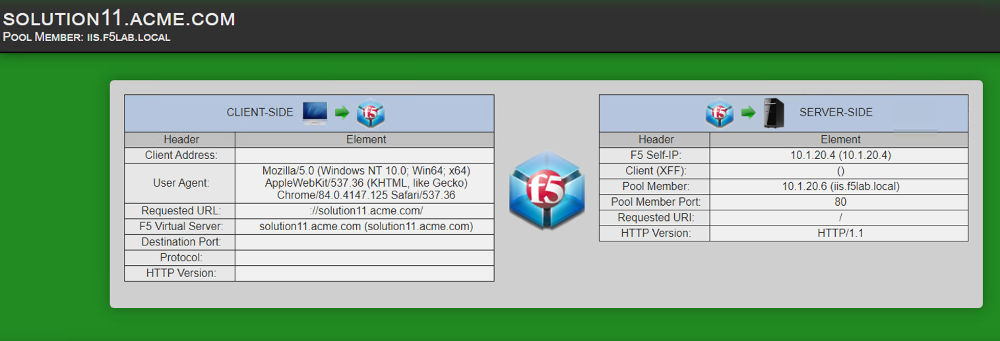

Solution11 Policy
======================================================

Policy Walk-Through
----------------------

|image001|

#.  When a user accesses a VIP protected by this policy the user is redirected to the provider selected for authentication.
#.  Upon successful Authentication, the user is granted access via the Allow Terminal
#.  If unsuccessful, the user proceeds down the fallback branch and denied access via the Deny Terminal

Policy Agent Configuration
----------------------------

The OAuth Client Settings

|image002|

Profile Settings
-------------------

All profile settings are left the defaults

Supporting APM Objects
-----------------------

Oauth Server
^^^^^^^^^^^^^

The OAuth Server setting specify it will be a client only.

|image003|

Provider
^^^^^^^^^

The settings below define all the components of the Authorization Server's endpoints to retrieve and validate tokens.

|image004|

JSON Web Token
^^^^^^^^^^^^^^^

The JWT setting define the the signing algorithms used by a provider with a set of jwks.  This token was auto discovered from the Authorization server.

|image005|

JWT Key
^^^^^^^^^^^^^^^^

The key settings define a type of key and its properties.  This JWK was auto discovered from the authorization server.

|image006|

Unique BIG-IP settings
-----------------------

DNS Resolver
^^^^^^^^^^^^

The properties section are default settings

|image007|

The Forward Zones section forwards all request to a single DNS server.

|image008|

The Policy from a user's perspective
-------------------------------------

If the user attempts to access https://solution11.acme.com via a web browser they are redirected to the solution10 Authorization Server.

|image009|

Once authenticated the user is redirected back to  the solution11 website.

|image010|

This solution is designed to be integrated with other Authorization Server based solutions.

