Solution12 Policy
======================

Policy Walk-Through
-------------------------------------

|image001|

#.  In this policy a user enters their credentials in the logon page agent.

    - Those credentials are collected, stored as the default system session variables of session.logon.last.username and session.logon.last.password.

#.  The AD Auth Agent validates the the username and password session variables against the configured AD Domain Controller.
#.  The RDG policy is evaluated for access control
#.  Domain variables are assigned
#.  The user is assigned resourced defined in the Advanced Resource Assign Agent
#.  The user is granted access via the Allow Terminal
#.  If unsuccessful, the user proceeds down the fallback branch and denied access via the Deny Terminal

Policy Agent Configuration
----------------------------

The Logon Page contains only the default setting

|image002|

The AD Auth Agent uses a defined the  AD AAA Server object that user will be authenticated against.  All Setting are the default.

|image003|

The RDG Policy assignment agent inherits the settings defined in a separate RDG Policy.

|image004|

The Variable Assign objects defined the AD domain name to support SSO to the VDI resource.

|image005|

The Advanced resource Assign Agent grants a user access to the assigned RDP resource and webtop.

|image006|

Customized APM Profile Settings
----------------------------------

- The APM Profiles settings are the default.

Supporting APM Objects
-----------------------

AAA AD Server Object
^^^^^^^^^^^^^^^^^^^^^

|image007|

Webtop
^^^^^^^^^^^^^^^

|image008|

Connectivity Profile
^^^^^^^^^^^^^^^^^^^^^^

This profile uses the default settings

|image009|

VDI Profile
^^^^^^^^^^^^^

This profile uses its default settings

|image010|

RDP Resource
^^^^^^^^^^^^^^

|image011|

RDG policy
^^^^^^^^^^^^^^

The RDG profile is used for controlling access to RDP resources.  The profile permits access to any resource.

|image012|

User's Perspective
---------------------

1. A user connects to https://solution12.acme.com and redirected to a logon page.

:username: user1
:Password: user1

|image013|

2. After successful logon the user is presented a webtop with RDP resources

|image014|

3. The user clicks the RDP resource icon on the webtop, downloads the .rdp file, and clicks the .rdp file.

|image015|

4. The desktop for the RDP resource opens.

|image016|

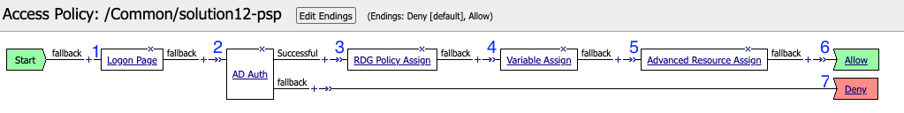
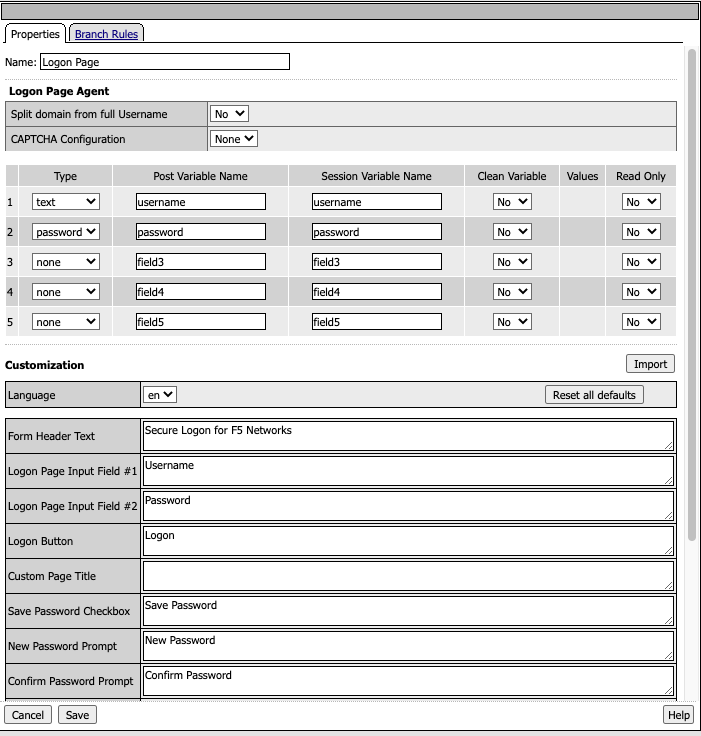
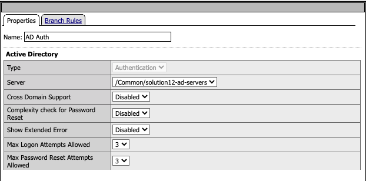
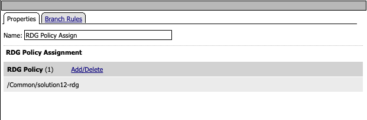
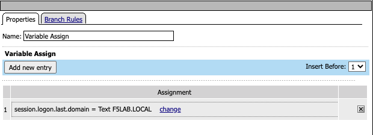
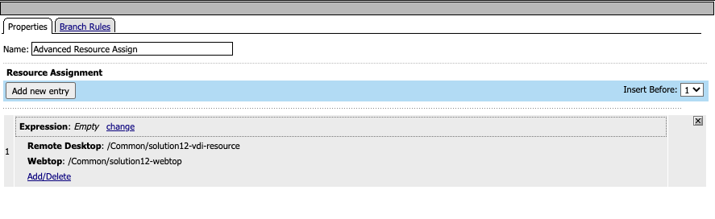
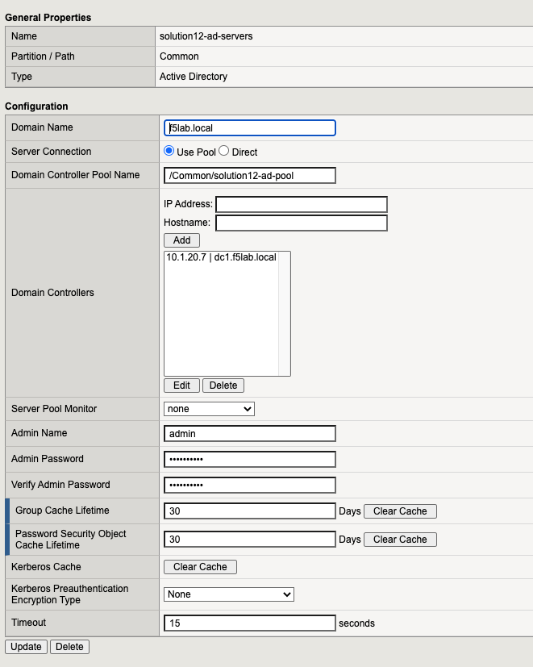
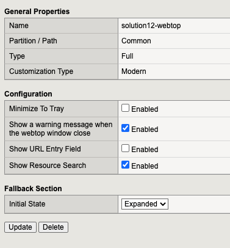
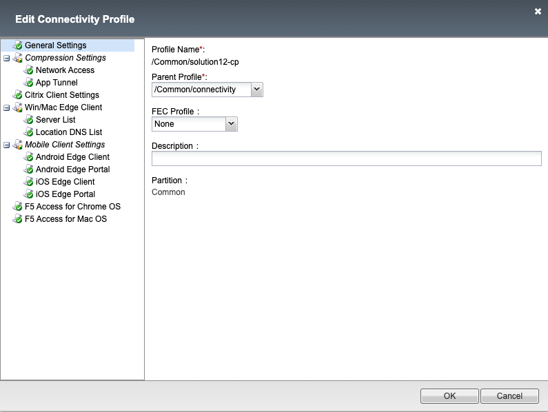
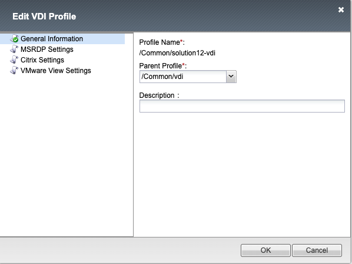
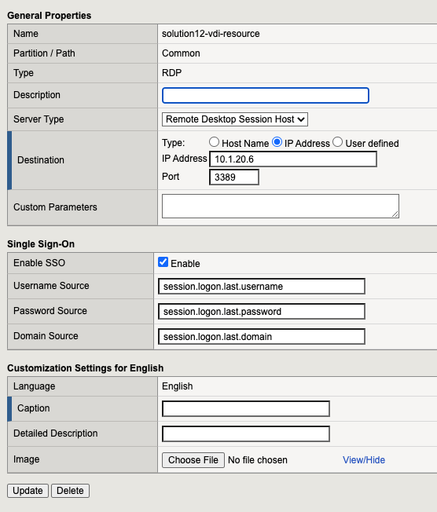
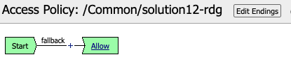
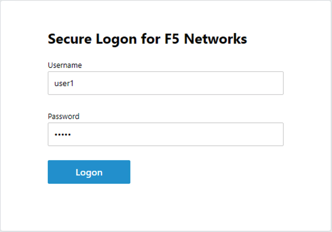
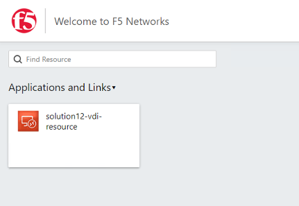
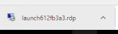
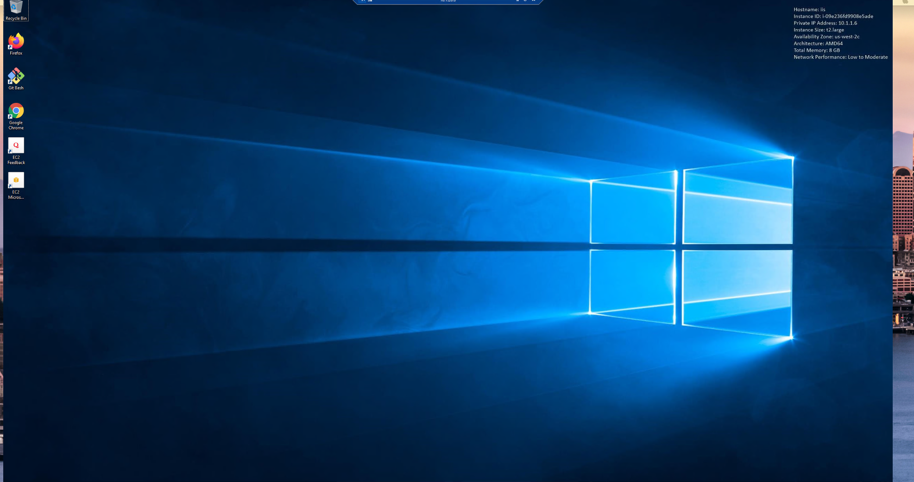
