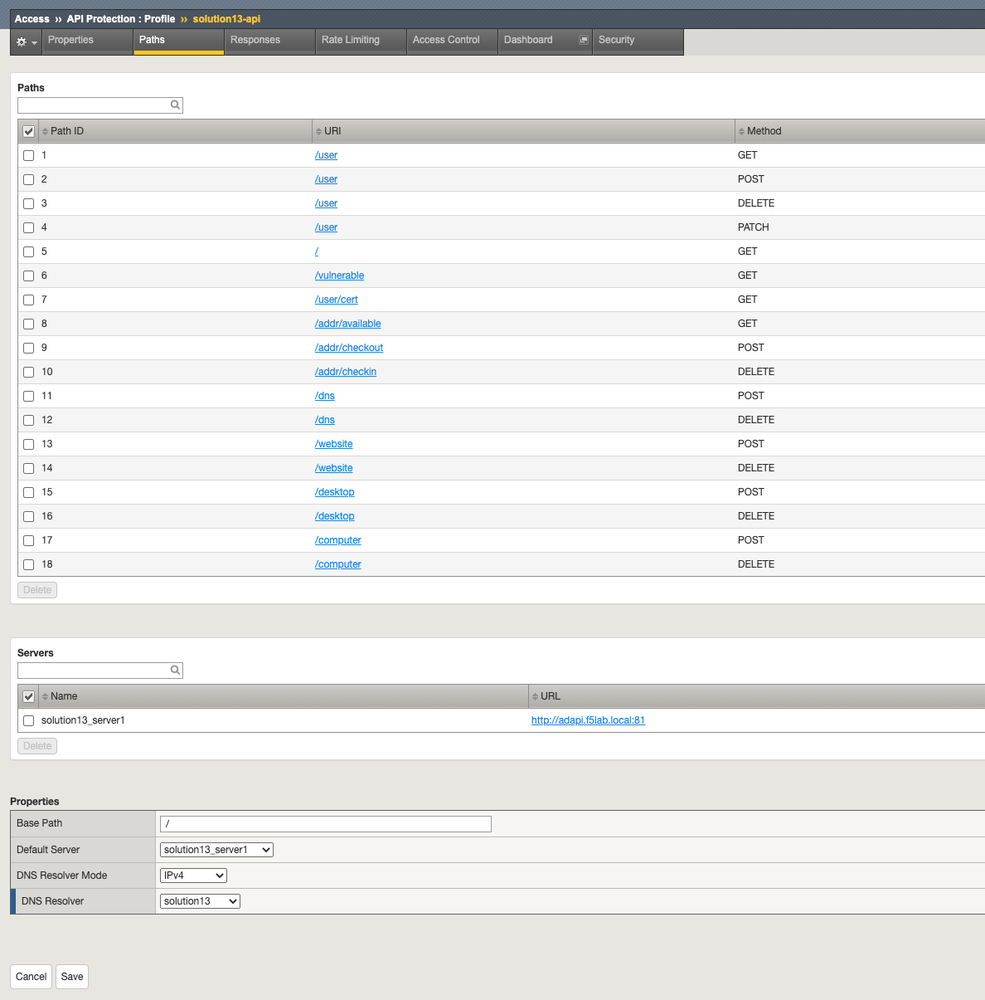
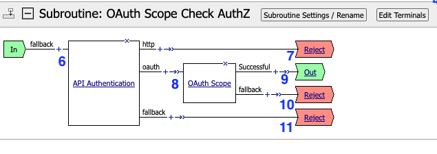
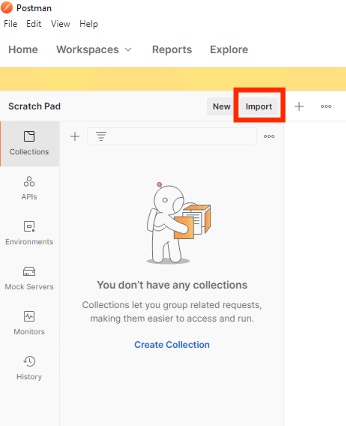
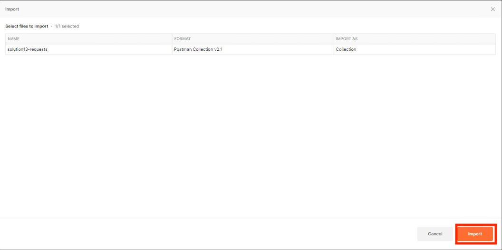
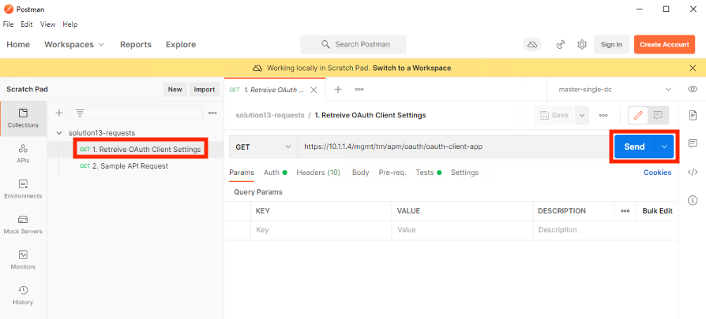

The API Protection Profile
===========================

Properties
-------------------------------------
The properties section displays the current version of the swagger file.

|image001|

Paths
-----------

The path section displays each path and method combination along with it's associated Path ID.  Path IDs are used in the Access Policy.

The Servers section contains the destinations for API routing.

In the properties section the default server is **solution13_server1**.  In the case of this example, no endponts have an alternative server destination so all endpoints will use the default server selected.
|image002|

Responses
--------------

The first threee responses are the defaults that would be created if the API protection were created manually.

The last two responses are parsed from the OpenAPI spec file.

|image003|

Rate Limiting
---------------

No rate limiting option were defined

|image004|

Access Control (The Policy)
------------------------------

|image005|

Per-Request Policy
^^^^^^^^^^^^^^^^^^^^^
|image006|

1. When a user accesses a VIP protected by this policy they enter the **OAuth Scope Check AuthZ** Subroutine.
2. Upon successful completion of the **OAuth Scope Check AuthZ** Subroutine the API endpoint is identified.
3. If the endpoint exists in the policy, the user is granted access via the Allow Terminal.
4. If endpoint does not exist, the user proceeds down the fallback branch and denied access via the Reject Terminal.
5. If the **OAuth Scope Check AuthZ** subroutine is unsuccessful, the user proceeds down the fallback branch and denied access via the Reject Terminal.

Subroutine - OAuth Scope Check AuthZ
^^^^^^^^^^^^^^^^^^^^^^^^^^^^^^^^^^^^^^

|image007|

6. When a user accesses a VIP protected by this policy they enter the **OAuth Scope Check AuthZ** Subroutine.
7. If http basic is used for authentication , the user proceeds down the fallback branch and denied access via the Reject Terminal.
8. If a bearer token is used for authentication, the JWT scopes are validated.
9. If the JWT token is valid , the user is sent to the Out Terminal.
10. If the JWT token is invalid, the user is sent to the Reject Terminal.
11. If no authentication method is specified, the user is sent to the Reject Terminal.

Policy Agent Configuration
----------------------------

API Authentication
^^^^^^^^^^^^^^^^^^^

This agent supports two authentication methods by default.

|image008|

OAuth Scope
^^^^^^^^^^^^^

|image009|

Classify API Request (RCA)
^^^^^^^^^^^^^^^^^^^^^^^^^^^^
This agent specifies path IDs used for each branch rule.  The Path IDs were defined in the Path section of the API protection profile.

|image010|

Supporting APM Objects
-----------------------

JSON Webtoken Provider List
^^^^^^^^^^^^^^^^^^^^^^^^^^^^^

|image011|

OAuth Provider
^^^^^^^^^^^^^^^

|image012|

JSON Token Configuration
^^^^^^^^^^^^^^^^^^^^^^^^^^^

|image013|

JSON Key Configuration
^^^^^^^^^^^^^^^^^^^^^^^^

|image014|

User's Perspective
---------------------

This solution is designed to be integrated with Authorization Server based solutions. Please ensure you deply the Authoriztion Server prior to deploying this solution.

#. Open **Postman** on the Jumphost
#. Click **Import**

    |image015|

#. Click **Upload Files**

    |image016|

#. Navigate to C:\\access-solutions\\solution13\\student_files, select solution9 request.json, and click Open

    |image017|

#. Click **Import**

    |image018|

 #. Expand the collection.
 #. Select **1. Retreive OAuth Client Settings**
 #. Click **Send**

    |image019|

#.  You will receive a response body containing the ClientId and ClientSecret.  This request saved those values as a Postman Variables.

    |image020|

#. Select **2. Sample API Request**
#. Click the **Authorization** tab.
#. Click **Get New Access Token** 
   
    |image021|

#. Login using Username: user1 and Password: user1   

    |image022|

#. Click **Use Token**

    |image023|

#. Click **Send**

    |image024|

#.  The user receives a 200 OK with a response.  The Access Token was successfully validated by the BIG-IP to permit access.

    |image025|

.. |image004| image:: media/004.png
.. |image005| image:: media/005.png
.. |image006| image:: media/006.png

.. |image008| image:: media/008.png

.. |image011| image:: media/011.png
.. |image012| image:: media/012.png
.. |image013| image:: media/013.png

.. |image016| image:: media/016.png

.. |image020| image:: media/020.png
.. |image021| image:: media/021.png

