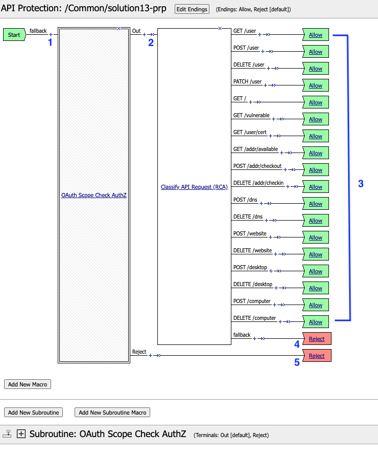
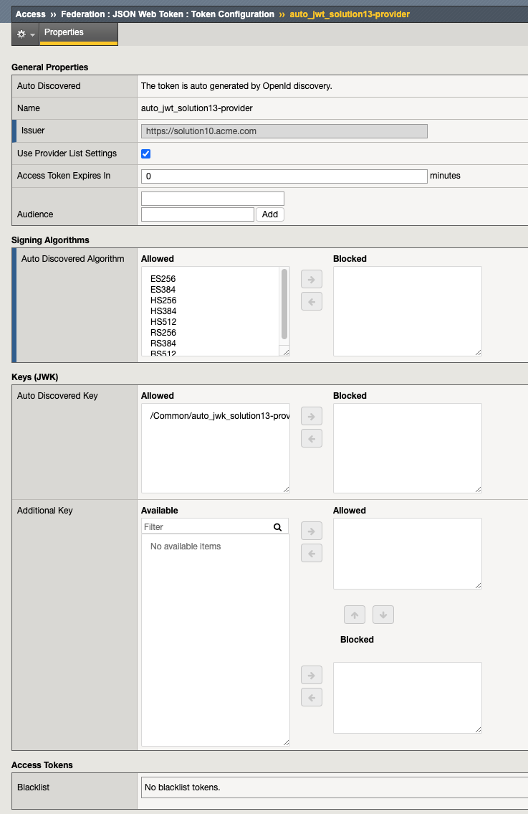
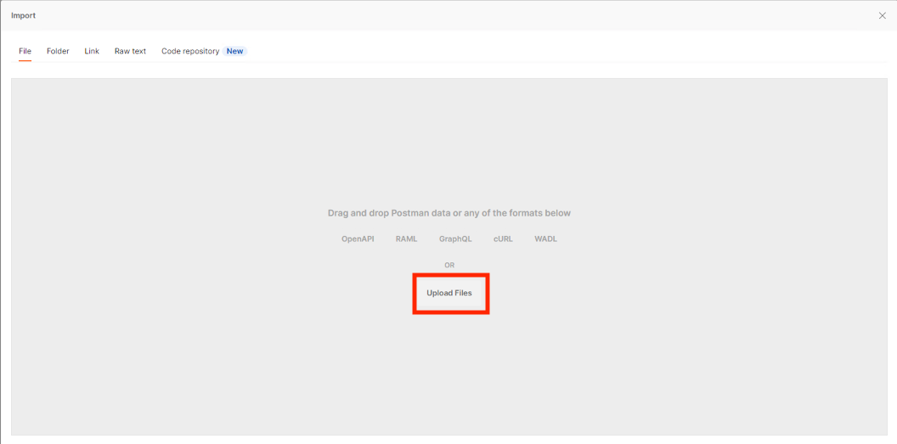
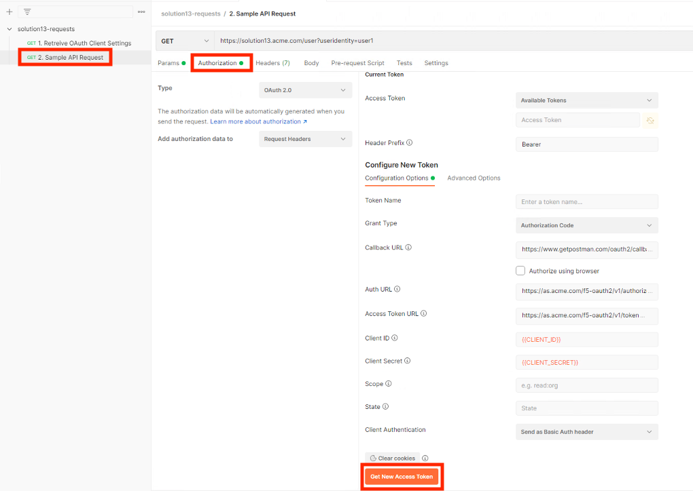

The Profile
==============

Properties
-------------------------------------

|image001|

Paths
-----------
|image002|

Responses
--------------
|image003|

Rate Limiting
---------------
|image004|

Access Control (The Policy)
------------------------------

|image005|

Per-Request Policy
^^^^^^^^^^^^^^^^^^^^^
|image006|

Subroutine - OAuth Scope Check AuthZ
^^^^^^^^^^^^^^^^^^^^^^^^^^^^^^^^^^^^^^

|image007|

Policy Agent Configuration
----------------------------

API Authentication

|image008|

OAuth Scope

|image009|

Classify API Request (RCA)

|image010|

Supporting APM Objects
-----------------------

JSON Webtoken Provider List
^^^^^^^^^^^^^^^^^^^^^^^^^^^^^

|image011|

OAuth Provider
^^^^^^^^^^^^^^^

|image012|

JSON Token Configuration
^^^^^^^^^^^^^^^^^^^^^^

|image013|

JSON Key Configuration
^^^^^^^^^^^^^^^^^^^^^^^^

|image014|

User's Perspective
---------------------

.. note:: 
    The settings required for Postman are displayed in the automation's last request.  The setting required to see the solution will be different in your UDF deployment.  

|image015|

1. Specify the settings required for the authorization server and the client settings

|image016|

1. The Authorization Server logon form opens

:username: user1
:Password: user1

|image017|

2. Select **User Token**

|image018|

3. Click Send.

|image019|

4. The body contains user's attributes.

|image020|

5. If the user attempts to access the API without a token they receive a 403

|image21|

.. |image001| image:: media/001.png
.. |image002| image:: media/002.png
.. |image003| image:: media/003.png

.. |image007| image:: media/007.png

.. |image009| image:: media/009.png
.. |image010| image:: media/010.png

.. |image014| image:: media/014.png
.. |image015| image:: media/015.png

.. |image017| image:: media/017.png
.. |image018| image:: media/018.png
.. |image019| image:: media/019.png
.. |image020| image:: media/020.png

