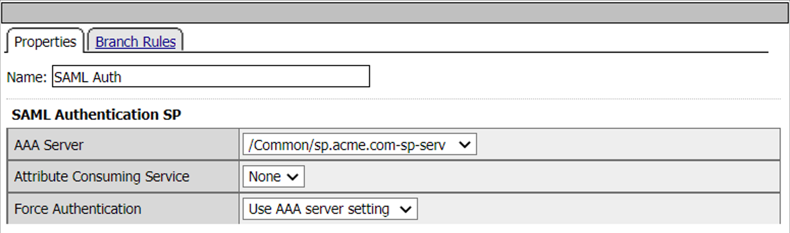
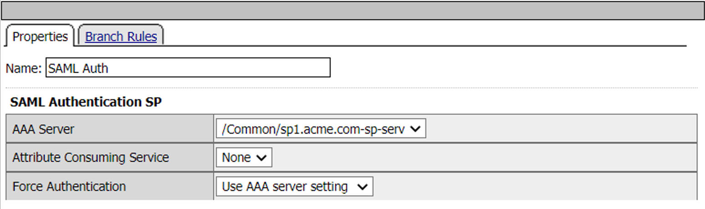
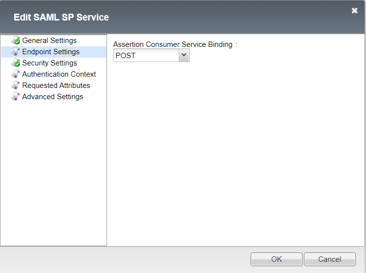
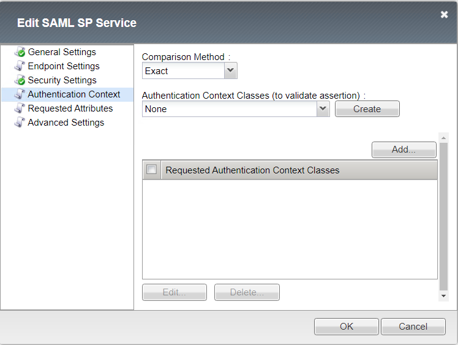

Solution14 Policy
======================

Policy Walk-Through
-------------------------------------

This soultion requires creation of two access policies, a default allow per-session and a per-request policy augmented by X number of subroutines.

|image001|

#.  This initial access policy (default allow) is a per-session policy to populate required session variable name and values.
		- This will be used to facilate the SAML-SP discovery of the apporaite SAML-IdP. 

|image002|

This "per-request policy is the scaffolding to build service call to one or more authentication authorization services.

#.  This URL Branching action is used to interrogate the service URL and vector it to the appropriate SAML-SP Subroutine.
#.  This sp.acme.com success action branch enable the configured SAML-sp subroutine.
#.	Successful authentication of user credentials against the application pool sp_pool.
#.	Defines the service adderess location for https://sp.acme.com
#.	Success branch for sp.acme.com
#.	SAML SP authentucation failure branch.
#.  This sp1.acme.com success action branch enable the configured SAML-sp1 subroutine.
#.	Successful authentication of user credentials against the application pool sp1_pool.
#.	Defines the service adderess location for https://sp1.acme.com
#.	Success branch for sp1.acme.com
#.	SAML SP1 authentucation failure branch.

Policy Agent Configuration
-------------------------------------

URL Branching action used to interrogate the service URL and vector it to the difference SAML-SP pools.

|image003|

Add subroutine sp SAML Authentication

|image004|

SAML Auth properties

Select the appropriate server from the drop down menu.

|image005|

Under the Branch Rule tab ensure Insert Before: is set to Successful.

Add another subroutine for sp1 SAML Authentication.

|image007|

Under the Branch Rule tab ensure Insert Before: is set to Successful.

From the sp Success branch add an assignment action for each of the SAML-SP pools. Under the properties add the appropriate SAML-SP pool.

|image009|

Under the branch rule tab add a fallback branch to an allow ending.

|image010|

Under the properties tab configure the SAML Authentication SP1 AAA Server URL for sp1_pool.

|image011|

Under the branch rule tab add a fallback branch to an allow ending.

|image012|

Profile Settings
------------------------------------------

Create local SAML Service Provider objects for each of the SAML-IdP to be discovered.
	- The SAML-SP object or objects settings are will be bound to a unigue IdP URL.
	
|image013|

 
General settings for sp.acme.com:

|image014|

Endpoint setting for sp.acme.com:

|image015|

Secirity Settings Authentication and Encryption Settings.

|image016|

Authentication Context set Comparison Method and Authentication Context Classes.

|image017|

Requested Attributes left at default.

|image018|

Advance Settings.

|image019|

General settings for sp1.acme.com:

|image020|

Endpoint setting for sp1.acme.com:

|image021|

Secirity Settings Authentication and Encryption Settings.

|image022|

Authentication Context set Comparison Method and Authentication Context Classes.

|image023|

Requested Attributes left at default.

|image024|

Advance Settings.

|image025|

Configurate SAML Service Provider External IdP Connectors .

|image026|

External SAML IdP Connector General Settings. 

|image027|

External SAML IdP Connector endpoint SSO Service settings.

|image028|

External SAML IdP Connector endpoint Artifact Resolution Service settings.

|image029|

External SAML IdP Connector Assertion Settings.

|image030|

External SAML IdP Connector Security Settings.

|image031|

External SAML IdP Connector Single Logout Service settings.

|image032|

Create External SP Connectors.

|image033|

External SAML SP Connector General Settings.

|image034|

External SAML SP Connector Endpoing Settings.

|image035|

External SAML SP Connector Security Settings.

|image036|

External SAML SP Connector Single Logout Service settings.

|image037|

External SAML IdP Connector SP Location Settings.

|image038|

User's Perspective
---------------------

The user accessing https://sp.acme.com or https://sp1.acme.com is directed to a SAML Logon Page.
|image039|

The users authentication assertion directed from the SAML-SP to the appropriate SAML-IdP for authorization. 
|image040|

Once the user is authenticated they are transparently redirected to the service asset.
|image041|

.. |image001| image:: media/001.png
.. |image002| image:: media/002.png
.. |image003| image:: media/003.png

.. |image005| image:: media/005.png

.. |image007| image:: media/007.png
.. |image008| image:: media/008.png
.. |image009| image:: media/009.png

.. |image011| image:: media/011.png

.. |image014| image:: media/014.png
.. |image015| image:: media/015.png

.. |image001| image:: media/017.png
.. |image002| image:: media/018.png

.. |image005| image:: media/021.png
.. |image006| image:: media/022.png
.. |image007| image:: media/023.png
.. |image008| image:: media/024.png

.. |image010| image:: media/026.png

.. |image012| image:: media/028.png

.. |image014| image:: media/030.png
.. |image015| image:: media/031.png
.. |image016| image:: media/032.png
.. |image001| image:: media/033.png
.. |image002| image:: media/034.png
.. |image003| image:: media/035.png
.. |image004| image:: media/036.png
.. |image005| image:: media/037.png
.. |image006| image:: media/038.png
.. |image007| image:: media/039.png
.. |image008| image:: media/040.png

