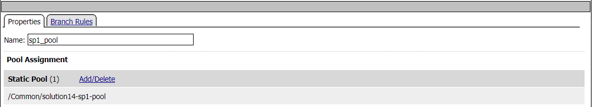
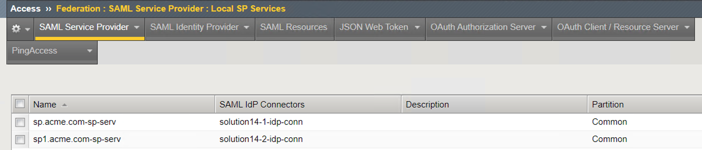

Solution14 Policy
======================

Per-Session Policy Walk-Through
-------------------------------------

This solution requires creation of two access policies. A default allow per-session policy and a per-request policy using two subroutines.

|image001|

#.  This initial access policy (default allow) is a per-session policy to populate required session variable name and values.

Per-Request Policy Walk-Through
--------------------------------------

This per-request access policy accepts users request and redirect them to one of the two SAML Auth Subroutines configured for sp.acme.com or sp1.acme.com.

|image002|

Per-Request Policies are an extension of a per-session policy by enabling fine-grain control over a users session on request by request basis.

#.  This URL Branching action is used to interrogate the service URL and vector it to the appropriate SAML-SP Subroutine.
#.  When a user is directed to a SAML Auth agent they are redirected to the IDP selected by the SP Service(sp.acme.com).
#.	Upon successful authentication at the IDP, the user is redirected back to the SP. The SP service consumes the Assertion. The user is directed to the Success Terminal.
#.	Upon unsuccessful authentication, the user proceeds down the fallback branch and directed to the Fail Terminal.
#.	Pool sp.acme.com-pool is assigned to the request for load balancing. Traitional LTM load balancing rules still apply.
#.	The user is granted access via the Allow Terminal.
#.	User credentials failed the selected authentication and is directed to the Reject Terminal.
#.  When a user is directed to a SAML Auth agent they are redirected to the IDP selected by the SP Service(sp1.acme.com).
#.	Upon successful authentication at the IDP, the user is redirected back to the SP. The SP service consumes the Assertion. The user is directed to the Success Terminal.
#.	Upon unsuccessful authentication, the user proceeds down the fallback branch and directed to the Fail Terminal.
#.	Pool sp1.acme.com-pool is assigned to the request for load balancing. Traitional LTM load balancing rules still apply.
#.	The user is granted access via the Allow Terminal.
#.	User credentials failed the selected authentication and is directed to the Reject Terminal.
#.	Users request did not meet either of Subroutine URI requirements.

Policy Agent Configuration
-------------------------------------

URL Branch Rules

|image003|

SAML Auth Agent - SP

|image004|

Pool Assign - sp_pool

|image005|

SAML Auth Agent - SP1

|image006|

Pool Assign - sp1_pool

|image007|

Profile Settings
--------------------------------------

All profile settings are left the defaults

Supporting APM Objects
--------------------------------------

SP Service (sp.acme.com)
^^^^^^^^^^^^^^^^^^^^^^^^^^

Local SAML Service Provider

|image008|

General Settings 

|image009|

Endpoint Settings 

|image010|

Security Settings 

|image011|

Authentication Context 

|image012|

Advanced Settings

|image014|

SP Service (sp1.acme.com)
^^^^^^^^^^^^^^^^^^^^^^^^^^

General Settings 

|image015|

Endpoint  Settings 

|image016|

Security Settings 

|image017|

Authentication Context 

|image018|

Advanced Settings

|image020|

External IdP Connectors (sp-sso)
^^^^^^^^^^^^^^^^^^^^^^^^^^^^^^^^^^^

|image021|

General settings 

|image022|

Endpoint Single Sign On Service 

|image023|

Assertion Settings 
|image024|

Security Settings 

|image025|

Single Logout Service Settings 

|image026|

External IdP Connectors (sp1-sso)
^^^^^^^^^^^^^^^^^^^^^^^^^^^^^^^^^^^

General settings 

|image027|

Endpoint Single Sign On Service 

|image028|

Assertion Settings 

|image029|

Security Settings 

|image030|

Single Logout Service Settings 

|image031|

User's Perspective
---------------------

The user attempting to access https://sp1.acme.com is directed to AzureAD for authentication. 

- Username: user1@f5access.onmicrosoft.com
- Password: F5twister$

|image040|

Once the user is authenticated they are transparently redirected back to the resource. In this case, it is sp1.acme.com

|image041|

Once the user in authenticated at the Identity Provider, they are allowed access to sp.acme.com without need to re-authenticate.

|image042|

.. |image001| image:: media/001.png
.. |image002| image:: media/002.png
.. |image003| image:: media/003.png
.. |image004| image:: media/004.png
.. |image005| image:: media/005.png
.. |image006| image:: media/006.png

.. |image010| image:: media/010.png
.. |image011| image:: media/011.png
.. |image012| image:: media/012.png
.. |image013| image:: media/013.png
.. |image014| image:: media/014.png
.. |image015| image:: media/015.png
.. |image016| image:: media/016.png
.. |image017| image:: media/017.png
.. |image018| image:: media/018.png
.. |image019| image:: media/019.png
.. |image020| image:: media/020.png
.. |image021| image:: media/021.png

.. |image023| image:: media/023.png
.. |image024| image:: media/024.png
.. |image025| image:: media/025.png
.. |image026| image:: media/026.png
.. |image027| image:: media/027.png
.. |image028| image:: media/028.png
.. |image029| image:: media/029.png

.. |image031| image:: media/031.png
.. |image032| image:: media/032.png
.. |image033| image:: media/033.png
.. |image034| image:: media/034.png
.. |image035| image:: media/035.png
.. |image036| image:: media/036.png
.. |image037| image:: media/037.png
.. |image038| image:: media/038.png
.. |image039| image:: media/039.png
.. |image040| image:: media/040.png
.. |image041| image:: media/041.png

