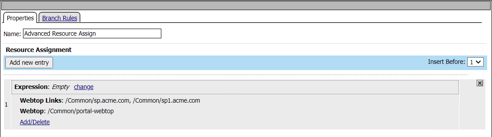
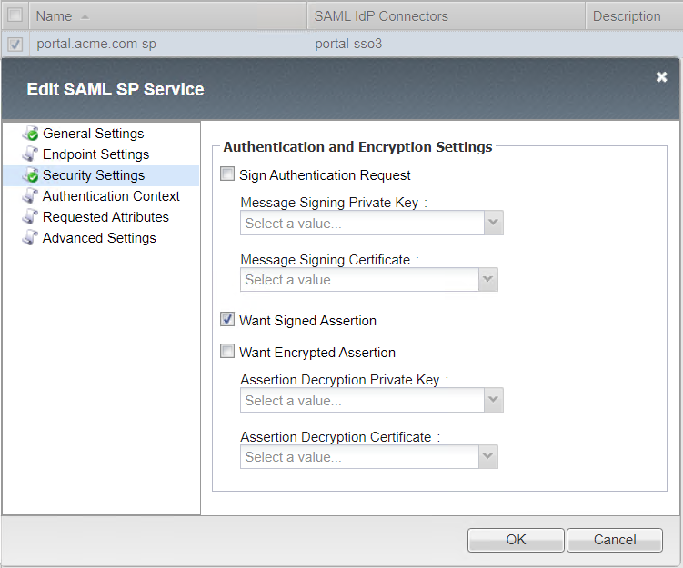
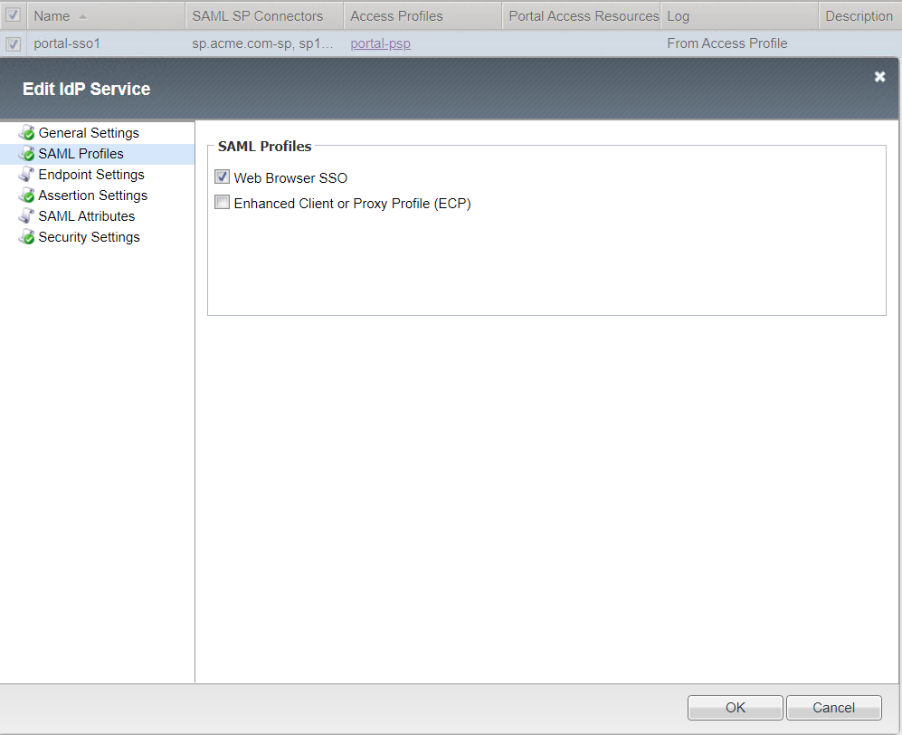
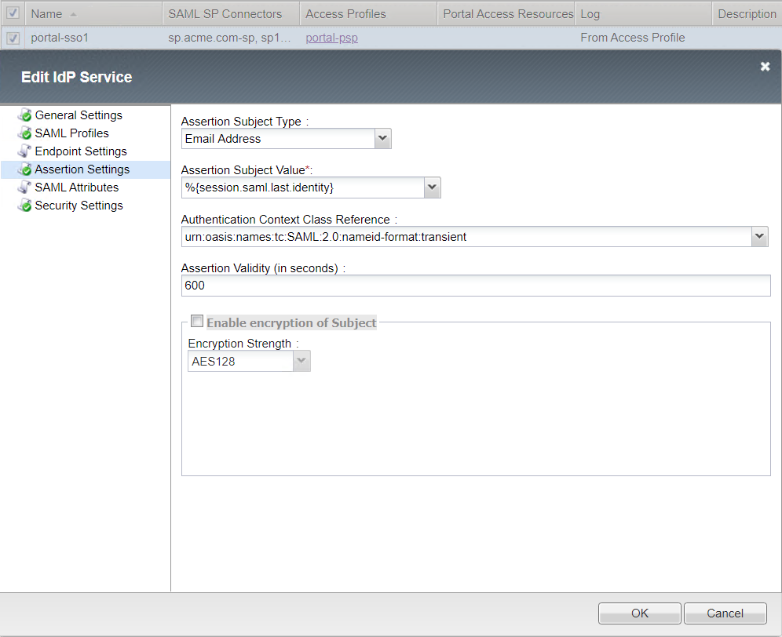
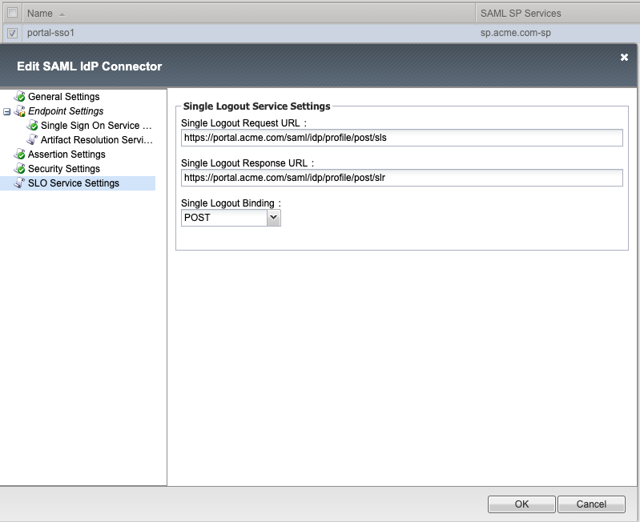

Solution15 Policies
======================

This solution requires creation of three access policies. A default allow per-session policy and a per-request policy using two subroutines for Identity Aware Proxy(IAP). The third policy will be used by a  virtual server performing both as a SAML SP to an external IDP along with SAML IDP to the Identity Aware Proxy virtual server.

Primary Identity Provider
---------------------------------

Per-Session Policy Walk-Through 
^^^^^^^^^^^^^^^^^^^^^^^^^^^^^^^^^^

|image002|

#.	When a user is directed to a SAML Auth agent they are redirected to the IDP(AzureAD) selected by the SP Service(portal.acme.com).
#.	Upon successful authentication at the IDP, the user is redirected back to the SP. The SP service consumes the Assertion. he user is assigned resources defined in the Advanced Resource Assign Agent
#.	After successful Resource Assignment, the user is granted access via the Allow Terminal.
#.	If SAML Authentication is unsuccessful, the user proceeds down the fallback branch to be denied access via the Deny Terminal

Per-Session Agent configuration 
^^^^^^^^^^^^^^^^^^^^^^^^^^^^^^^^^^

Portal-psp SAML Auth Agent

|image004|

Advanced Resource Assign

|image005|

Profile Settings
^^^^^^^^^^^^^^^^^^^^^

The Portal Profile settings have been modified in order to attach the IdP Service.

|image053|

Identity Aware Proxy
---------------------------------

Per-Session Policy Walk-Through
^^^^^^^^^^^^^^^^^^^^^^^^^^^^^^^^^^^^^^^^^^^^^^^^
|image001|

#.  This initial access policy (default allow) is a per-session policy to populate required session variable name and values.

Per-Request Policy Walk-Through
^^^^^^^^^^^^^^^^^^^^^^^^^^^^^^^^^^^^^^^^^^^^^^^^

This per-request access policy accepts users request and redirect them to  one of the two SAML Auth Subroutines configured for sp.acme.com or sp1.acme.com.

|image003|

#.  This URL Branching agent evaluates the requests host header to determine the appropriate next path.
#.  When a user is directed to a SAML Auth agent they are redirected to the IDP(portal.acme.com) selected by the SP Service(sp.acme.com).
#.	Upon successful authentication at the IDP, the user is redirected back to the SP. The SP service consumes the Assertion. The user is directed to the Success Terminal.
#.	Upon unsuccessful authentication, the user proceeds down the fallback branch the Fail Terminal.
#.	Pool sp.acme.com-pool is assigned to the request for load balancing. Traditional LTM load balancing rules still apply.
#.	The user is granted access via the Allow Terminal.
#.  Upon unsuccessful authentication, the user proceeds down the fallback branch to be  denied access via the Reject Terminal
#.  When a user is directed to a SAML Auth agent they are redirected to the IDP(portal.acme.com) selected by the SP Service(sp1.acme.com).
#.	Upon successful authentication at the IDP, the user is redirected back to the SP1. The SP service consumes the Assertion. The user is directed to the Success Terminal.
#.	Upon unsuccessful authentication, the user proceeds down the fallback branch and directed to the Fail Terminal.
#.	Pool sp1.acme.com-pool is assigned to the request for load balancing. Traditional LTM load balancing rules still apply.
#.	The user is granted access via the Allow Terminal.
#.  Upon unsuccessful authentication, the user proceeds down the fallback branch and directed to the Reject Terminal.
#.  The request does not contain a matching URL causing the request to proceed down the fallback branch to the Reject Terminal

Per-Request Agent configuration 
^^^^^^^^^^^^^^^^^^^^^^^^^^^^^^^^^^

URL Branch Rules

|image006|

Subroutine: SP - SAML Auth

|image007|

Subroutine: SP1 - SAML Auth

|image008|

Pool Assign - sp_pool

|image009|

Pool Assign - sp1_pool

|image010|

Profile Settings
^^^^^^^^^^^^^^^^^^^^^

The IAP profile settings are the default.

Supporting APM Objects
--------------------------

Configurations settings for Federation Services, (SP Services, IdP Connectors, IdP Services, SP Connectors).

SP Service List
^^^^^^^^^^^^^^^^^

|image054|

SP Service - Portal.acme.com-sp-serv
^^^^^^^^^^^^^^^^^^^^^^^^^^^^^^^^^^^^^^

General Settings

|image011|

Endpoint Settings

|image012|

Security Settings

|image013|

SP Service - sp.acme.com-sp-serv
^^^^^^^^^^^^^^^^^^^^^^^^^^^^^^^^^^^^

General Settings

|image014|

Endpoint Settings

|image015|

Security Settings

|image016|

SP Service - sp1.acme.com-sp-serv
^^^^^^^^^^^^^^^^^^^^^^^^^^^^^^^^^^^^

General Settings

|image017|

Endpoint Settings

|image018|

Security Settings

|image019|

IdP Connectors List
^^^^^^^^^^^^^^^^^^^^^

|image055|

IdP Connector - solution15-1-idp-conn
^^^^^^^^^^^^^^^^^^^^^^^^^^^^^^^^^^^^^^^
General Settings

|image048|

Endpoint Settings
	- Single Sign On Service

|image049|

Assertion Settings

|image050|

Security Settings

|image051|

Single Logout Service Settings

|image052|

IdP Connector - solution15-2-idp-conn
^^^^^^^^^^^^^^^^^^^^^^^^^^^^^^^^^^^^^^^

General Settings

|image029|

Endpoint Settings
	- Single Sign On Service

|image030|

Security Settings

|image031|

Single Logout Service Settings

|image032|

Local IdP Service List
^^^^^^^^^^^^^^^^^^^^^^^^

|image056|

Local IdP Service - portal.acme.com-1-idp-service
^^^^^^^^^^^^^^^^^^^^^^^^^^^^^^^^^^^^^^^^^^^^^^^^^^^^

General Settings

|image020|

SAML Profiles

|image021|

Endpoint Settings

|image022|

Assertion Settings

|image023|

Security Settings

|image024|

External SP Connector List
^^^^^^^^^^^^^^^^^^^^^^^^^^^^

|image057|

SP Connector - sp.acme.com-sp-conn 
^^^^^^^^^^^^^^^^^^^^^^^^^^^^^^^^^^^^^^^

General Settings

|image033|

Endpoint Settings

- Location URL : https://sp.acme.com/saml/sp/profile/post/acs

|image034|

Security Settings

|image035|

Single Logout Service Settings

|image036|

SP Location Settings

|image037|

SP Connector - sp1.acme.com-sp-conn 
^^^^^^^^^^^^^^^^^^^^^^^^^^^^^^^^^^^^^^^

General Settings

|image038|

Endpoint Settings

- Location URL : https://sp1.acme.com/saml/sp/profile/post/acs

|image039|

Security Settings

|image040|

Single Logout Service Settings

|image041|

SP Location Settings

|image042|

User's Perspective
---------------------

Accessing an Application Directly
^^^^^^^^^^^^^^^^^^^^^^^^^^^^^^^^^^^^
The user attempting to access https://sp.acme.com or https://sp1.acme.com is directed to portal.acme.com. Then, seamlessly redirected again to AzureAD for authentication.

 - Username: user1@f5access.onmicrosoft.com
 - Password: F5twister$

|image044|

Once the user is authenticated they are transparently redirected back to the resource.  In this case, it is sp.acme.com

|image045|

Accessing an Application via Portal
^^^^^^^^^^^^^^^^^^^^^^^^^^^^^^^^^^^^^^^
Users attempting to access https://portal.acme.com are redirected to AzureAD for authentication.

- Username: user1@f5access.onmicrosoft.com
- Password: F5twister$

|image044|

Once the user is authenticated they are transparently redirected back to the resource.  In this case, it is the Webtop Portal.

|image046|

Now that the user is authenticated at the IDP, when the user attempts to access sp.acme.com they are not prompted for further logon information.

|image047|

.. |image001| image:: media/001.png

.. |image007| image:: media/007.png

.. |image009| image:: media/009.png
.. |image010| image:: media/010.png

.. |image012| image:: media/012.png

.. |image015| image:: media/015.png

.. |image017| image:: media/017.png

.. |image019| image:: media/019.png
.. |image020| image:: media/020.png

.. |image022| image:: media/022.png

.. |image024| image:: media/024.png
.. |image029| image:: media/029.png

.. |image031| image:: media/031.png

.. |image037| image:: media/037.png

.. |image039| image:: media/039.png

.. |image042| image:: media/042.png

.. |image044| image:: media/044.png
.. |image045| image:: media/045.png
.. |image046| image:: media/046.png
.. |image047| image:: media/047.png
.. |image048| image:: media/048.png
.. |image049| image:: media/049.png
.. |image050| image:: media/050.png
.. |image051| image:: media/051.png

.. |image053| image:: media/053.png

.. |image056| image:: media/056.png
.. |image057| image:: media/057.png

