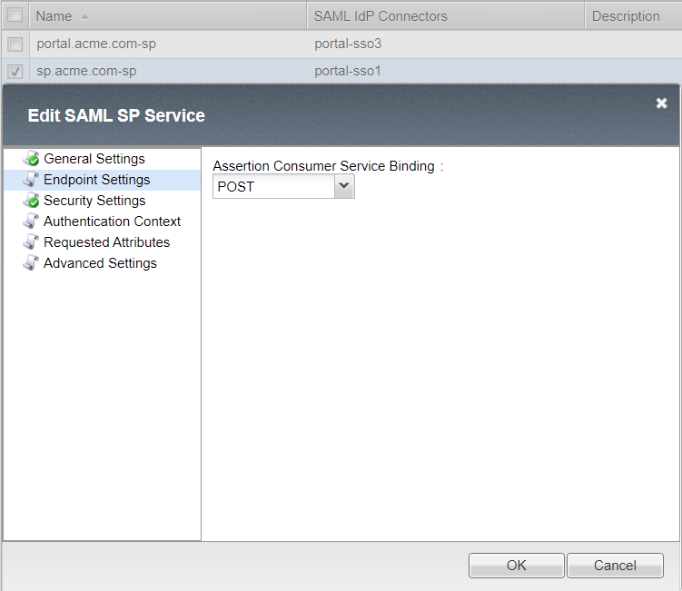
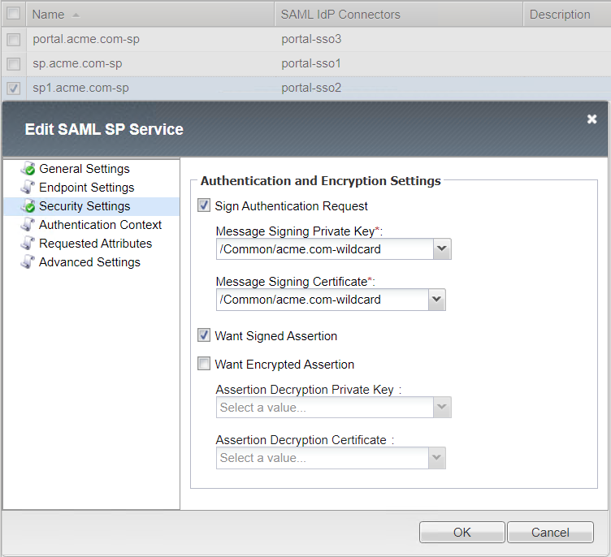
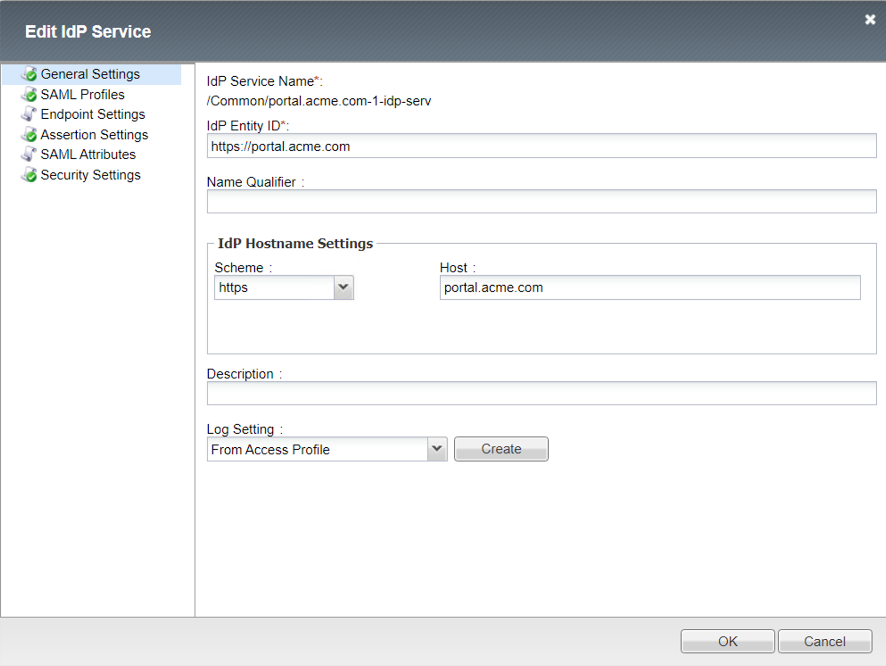
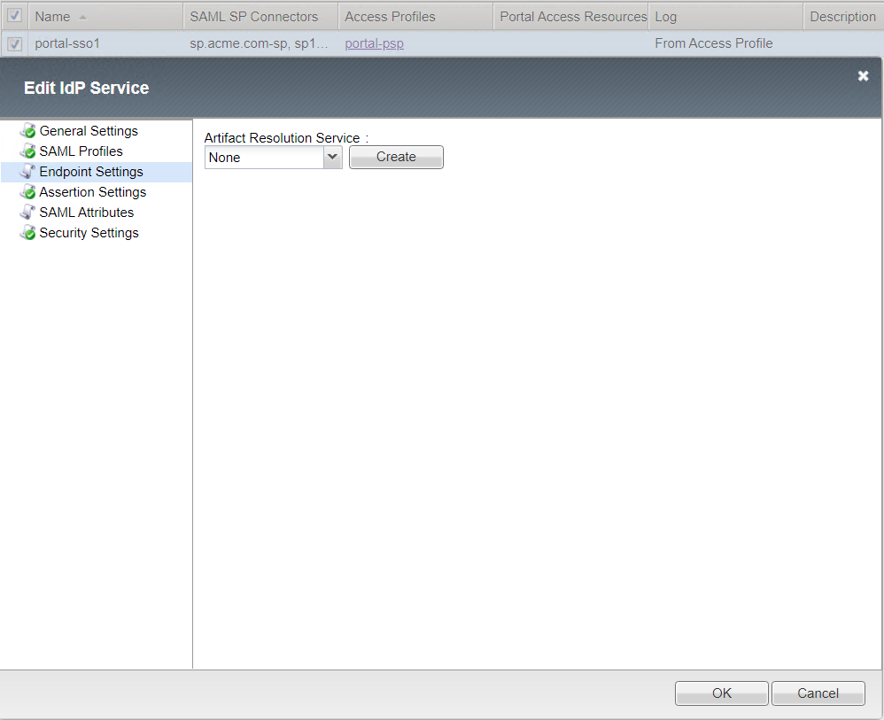
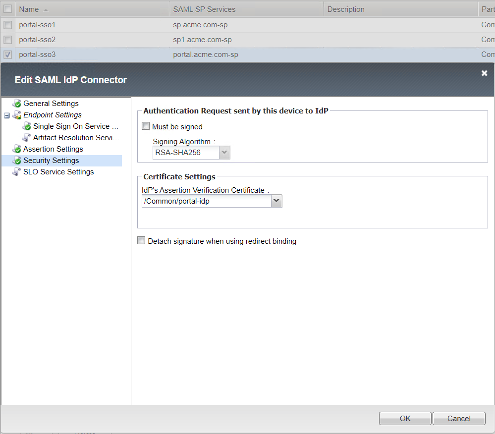
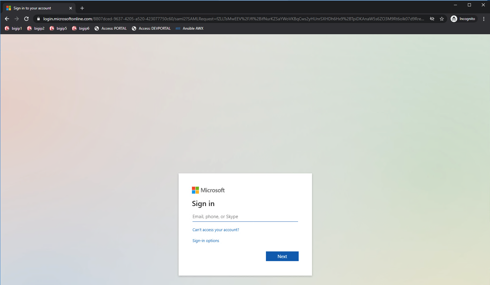
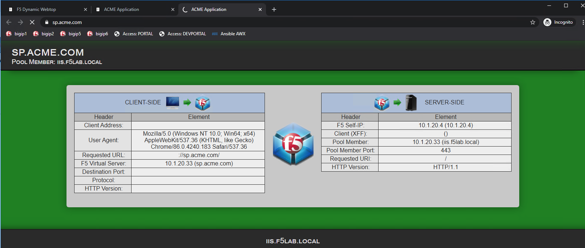
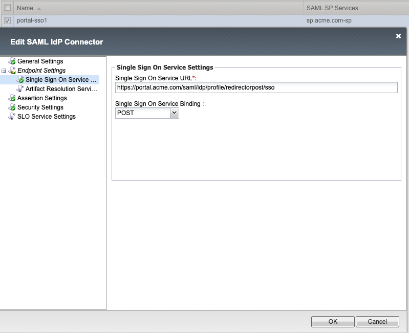
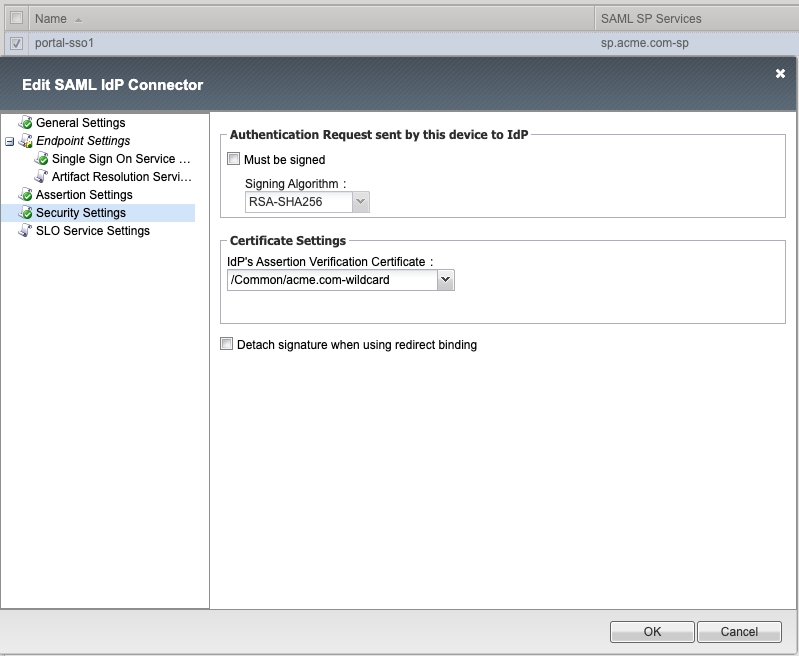

Solution15 Policy
======================

This solution requires creation of three access policies. A default allow per-session policy and a per-request policy using two subroutines for Identity Aware Proxy(IAP). The third policy will be used by the the virtual server performing both SAML SP to an external IDP and a SAML IDP to the Identity Aware Proxy Virtual Server.

Per-Session Policy Walk-Through
-------------------------------------

Per-Session Policy SAML Identity Provider
^^^^^^^^^^^^^^^^^^^^^^^^^^^^^^^^^^^^^^^^^^^

|image002|

#.	When a user is directed to a SAML Auth agent they are redirected to the IDP selected by the SP Service(portal.acme.com).
#.	Upon successful authentication at the IDP, the user is redirected back to the SP. The SP service consumes the Assertion. he user is assigned resources defined in the Advanced Resource Assign Agent
#.	After successful Resource Assignment, the user is granted access to the Allow Terminal.
#.	If SAML Authentication is unsuccessful, the user proceeds down the fallback branch to be denied access via the Deny Terminal

Per-Session Policy - SAML Identity Aware Proxy
^^^^^^^^^^^^^^^^^^^^^^^^^^^^^^^^^^^^^^^^^^^^^^^^
|image001|

#.  This initial access policy (default allow) is a per-session policy to populate required session variable name and values.

Per-Request Policy - SAML Identity Aware Proxy
^^^^^^^^^^^^^^^^^^^^^^^^^^^^^^^^^^^^^^^^^^^^^^^^

This per-request access policy accepts users request and redirect them to  one of the two SAML Auth Subroutines configured for sp.acme.com or sp1.acme.com.

|image003|

#.  This URL Branching agent evaluates the requests host header to determine the appropriate next path.
#.  When a user is directed to a SAML Auth agent they are redirected to the IDP(portal.acme.com) selected by the SP Service(sp.acme.com).
#.	Upon successful authentication at the IDP, the user is redirected back to the SP. The SP service consumes the Assertion. The user is directed to the Success Terminal.
#.	Upon unsuccessful authentication, the user proceeds down the fallback branch the Fail Terminal.
#.	Pool sp.acme.com-pool is assigned to the request for load balancing. Traditional LTM load balancing rules still apply.
#.	The user is granted access via the Allow Terminal.
#.  Upon unsuccessful authentication, the user proceeds down the fallback branch to be  denied access via the Reject Terminal
#.  When a user is directed to a SAML Auth agent they are redirected to the IDP(portal.acme.com) selected by the SP Service(sp1.acme.com).
#.	Upon successful authentication at the IDP, the user is redirected back to the SP1. The SP service consumes the Assertion. The user is directed to the Success Terminal.
#.	Upon unsuccessful authentication, the user proceeds down the fallback branch and directed to the Fail Terminal.
#.	Pool sp1.acme.com-pool is assigned to the request for load balancing. Traditional LTM load balancing rules still apply.
#.	The user is granted access via the Allow Terminal.
#.  Upon unsuccessful authentication, the user proceeds down the fallback branch and directed to the Reject Terminal.
#.  The request does not contain a matching URL causing the request to proceed down the fallback branch to the Reject Terminal

Policies Agent Configuration
-------------------------------------

Identity Provider Per-Session Agent configuration
^^^^^^^^^^^^^^^^^^^^^^^^^^^^^^^^^^^^^^^^^^^^^^^^^^^^

Portal-psp SAML Auth Agent

|image004|

Advanced Resource Assign

|image005|

Under the Properties tag from the drop down select the static pool /Common/solution15-sp-pool to the sp_pool action branch, and a fallback action to an allow action branch.

|image008|

Add Subroutines sp1 with Properties Name SAML Auth and SAML SAML Authentication SP AAA configured to /Common/sp1.acme.com-sp.

|image009|

Add the static pool /Common/solution15-sp1-pool to the sp_pool action branch, and a fallback action to an allow action branch.

|image010|

Identity Aware Proxy Per-Request Agent configuration
^^^^^^^^^^^^^^^^^^^^^^^^^^^^^^^^^^^^^^^^^^^^^^^^^^^^

Configure Branch Rule under the iap-prp URL Branch action branch.

|image007|

|image006|

#.	Add application url sp.acme.com
#.	Add application url sp1.acme.com
#.	Insert Before: sp..acme.com

Add Subroutines sp with Properties Name SAML Auth and SAML SAML Authentication SP AAA configured to /Common/sp.acme.com-sp.

Assign the the portal.acme.com-sp to the access policy portal-psp with branch rule to successful.

Profile Settings
------------------------------------------

Configure the F5 BIG-IP Federation Services supporting SAML Service Providers.
	- The SAML-SP object or objects settings are will be bound to a unique IdP URL.

|image011|

Configure Local SP Services portal.acme.com-sp beginning with the General Settings.

|image012|

Configure portal.acme.com-sp Endpoint Settings.

|image013|

Configure portal.acme.com-sp Security Settings.

|image014|

Configure portal.acme.com-sp Authentication Context.

|image015|

Configure portal.acme.com-sp Requested Attributes.

|image016|

Configure portal.acme.com-sp Advance Settings.

|image017|

Configure Local SP Services sp.acme.com-sp beginning with the General Settings.

|image018|

Configure sp.acme.com-sp Endpoint Settings.

|image019|

Configure sp.acme.com-sp Security Settings.

|image020|

Configure sp.acme.com-sp Authentication Context.

|image021|

Configure sp.acme.com-sp Requested Attributes.

|image022|

Configure sp.acme.com-sp Advance Settings.

|image023|

Configure Local SP Services sp1.acme.com-sp beginning with the General Settings.

|image024|

Configure sp1.acme.com-sp Endpoint Settings.

|image025|

Configure sp1.acme.com-sp Security Settings.

|image026|

Configure sp1.acme.com-sp Authentication Context.

|image027|

Configure sp1.acme.com-sp Requested Attributes.

|image028|

Configure sp1.acme.com-sp Advance Settings.

|image029|

Create the SAML SP associated External IdP Connectors.

|image030|

Configure the External IdP Connector for sp.acme.com-sp beginning with the General Settings.

|image031|

Configure the External IdP Connector for sp.acme.com-sp Endpoint Settings Single Sign On Service.
	- The Artifact Resolution Service can be left at default.

|image032|

Select subject from the drop down window within the Assertion Settings.

|image033|

Configure the appropriate authentication and certificate requirement in the Security Settings.

|image034|

Configure SLO Service Settings single logout request and response URLs.

|image035|

Configure the External IdP Connector for sp1.acme.com-sp beginning with the General Settings.

|image036|

Configure the External IdP Connector for sp1.acme.com-sp Endpoint Settings Single Sign On Service.
	- The Artifact Resolution Service can be left at default.

|image037|

Select subject from the drop down window within the Assertion Settings.

|image038|

Configure the appropriate authentication and certificate requirement in the Security Settings.

|image039|

Configure SLO Service Settings single logout request and response URLs.

|image040|

Configure the External IdP Cnnector for portal.acme.com-sp beginning with the General Settings.

|image041|

Configure the External IdP Connector for portal.acme.com-sp Endpoint Settings Single Sign On Service.
	- The Artifact Resolution Service can be left at default.

|image042|

Select subject from the drop down window within the Assertion Settings.

|image043|

Configure the appropriate authentication and certificate requirement in the Security Settings.

|image044|

Configure SLO Service Settings single logout request and response URLs.

|image045|

Configure Local IdP Services.

|image046|

Create local IdP service General Settings Service Name, IdP Entity ID, and Hostname settings.

|image047|

Select SAML Profiles.

|image048|

Endpoint Setting set to default.

|image049|

Configure IdP service Assertion Settings values.

|image050|

IdP SAML Attributes set to default.

Select the Security Settings, Signing Key and Signing Certificate.

|image051|

Configure the SAML IdP External SP Connectors.

|image052|

External Connector for SAML Office365
----------------------------------------------

Configure a SAML Office365 external connector beginning with the General Settings.
	- This connector could also be an enterprise AD FS server.

|image053|

Configure the Endpoint Settings Assertion Consumer Services by adding the appropriate URL.

|image054|

Configure Security Settings Response sent to SP by this device.

|image055|

SLO Service Settings Single Logout Binding set to POST.

|image056|

Select External for the SP Location Settings.

|image057|

Create and configure a SAML sp.acme.com-sp external connector beginning with the General Settings.
	- This connector could also be an enterprise AD FS server.

|image058|

Configure the Endpoint Settings Assertion Consumer Services by adding the appropriate URL.

|image059|

Configure Security Settings Signed Authentication Request and the Response sent to SP by this device.

|image060|

SLO Service Settings Single Logout Binding Single Logout Service Settings and Binding.

|image061|

Select External for the SP Location Settings.

|image062|

Create and configure a SAML sp1.acme.com-sp external connector beginning with the General Settings.
	- This connector could also be an enterprise AD FS server.

|image063|

Configure the Endpoint Settings Assertion Consumer Services by adding the appropriate URL.

|image064|

Configure Security Settings Signed Authentication Request and the Response sent to SP by this device.

|image065|

SLO Service Settings Single Logout Binding Single Logout Service Settings and Binding.

|image066|

Select External for the SP Location Settings.

|image067|

Configure the Webtop services with a link for the sp.acme.com and sp1.acme.com applications.

|image068|

User's Perspective
---------------------

The user accessing https://sp.acme.com or https://sp1.acme.com is directed to a SAML Logon Page.
|image069|

The users authentication assertion directed from the SAML-SP to the appropriate SAML-IdP for authorization.
|image070|

The request is then redirected to the appropriate portal.acme.com authorization services.

|image071|

Once the user is authenticated they are transparently redirected to the service asset.
|image072|

.. |image001| image:: media/001.png
.. |image002| image:: media/002.png
.. |image003| image:: media/003.png
.. |image004| image:: media/004.png
.. |image005| image:: media/005.png
.. |image006| image:: media/006.png
.. |image007| image:: media/007.png
.. |image008| image:: media/008.png

.. |image011| image:: media/011.png
.. |image012| image:: media/012.png
.. |image013| image:: media/013.png
.. |image014| image:: media/014.png

.. |image016| image:: media/016.png

.. |image018| image:: media/018.png

.. |image021| image:: media/021.png

.. |image023| image:: media/023.png

.. |image025| image:: media/025.png
.. |image026| image:: media/026.png
.. |image027| image:: media/027.png
.. |image028| image:: media/028.png

.. |image030| image:: media/030.png

.. |image032| image:: media/032.png
.. |image033| image:: media/033.png
.. |image034| image:: media/034.png
.. |image035| image:: media/035.png
.. |image036| image:: media/036.png

.. |image038| image:: media/038.png

.. |image040| image:: media/040.png
.. |image041| image:: media/041.png

.. |image043| image:: media/043.png

.. |image045| image:: media/045.png

.. |image052| image:: media/052.png

.. |image054| image:: media/054.png
.. |image055| image:: media/055.png

.. |image058| image:: media/058.png
.. |image059| image:: media/059.png
.. |image060| image:: media/060.png
.. |image061| image:: media/061.png
.. |image062| image:: media/062.png

.. |image066| image:: media/066.png
.. |image067| image:: media/067.png
.. |image068| image:: media/068.png
.. |image069| image:: media/069.png
.. |image070| image:: media/070.png
.. |image072| image:: media/072.png
.. |image073| image:: media/073.png
