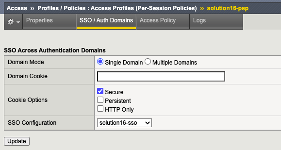
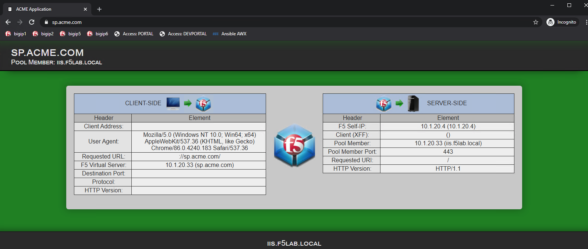

Solution16 Policy
======================

This solution documents all the necessary pieces required to create a Per-Request Policy configured for SAML authentication with Azure AD as IdP client-side with kerberos SSO autentication server-side to the application.

Per-Session Policy Walk-Through
-------------------------------------

Per-Session Policy - SAML Identity Provider with variable assign for extracted kerberos username
^^^^^^^^^^^^^^^^^^^^^^^^^^^^^^^^^^^^^^^^^^^^^^

|image002|

#.	When a user is directed to a SAML Auth agent they are redirected to the IDP(AzureAD) selected by the SP Service(sp.acme.com).
#.	Upon successful authentication at the IDP, the user is redirected back to the SP. The SP service consumes the Assertion. The SAML assertion APM variable will be mapped for SSO kerberos to consume the username
#.	After Variable Assignment, the user is granted access via the Allow Terminal.
#.	If SAML Authentication is unsuccessful, the user proceeds down the fallback branch to be denied access via the Deny Terminal

Policies Agent Configuration
-------------------------------------

Per-Session Agent configuration -Identity Provider
^^^^^^^^^^^^^^^^^^^^^^^^^^^^^^^^^^^^^^^^^^^^^^^^^^^^

solution16-psp SAML Auth Agent

|image003|

Variable Assign

|image004|

Single Sign On kerberos
------------------------

Kerberos Configuration

|image015|

Profile Settings
------------------------------------------

The Portal Profile settings have been modified in order to attach allow kerberos SSO.

|image005|

Supporting APM Objects
--------------------------

Configurations settings for Federation Services, (Local SP Services, External IdP Connectors).

+-------------------------------------------+
|        SP Service Binding Table           |
+=======================+===================+
|      SP Service       |    IDP Connector  |
+-----------------------+-------------------+
|  sp.acme.com-sp       |   solution16-sso |    |
+-----------------------+-------------------+

SP Service - sp.acme.com-sp 
^^^^^^^^^^^^^^^^^^^^^^^^^^^^^^^^^^^^

General Settings

|image006|

Endpoint Settings

|image007|

Security Settings

|image008|

IDP Connector - solution16-sso 
^^^^^^^^^^^^^^^^^^^^^^^^^^^^^^^^^^^^^^^

General Settings

|image009|

Endpoint Settings
	- Single Sign On Service

|image010|

Security Settings

|image011|

Single Logout Service Settings

|image012|

User's Perspective
---------------------

Accessing an Application Directly
^^^^^^^^^^^^^^^^^^^^^^^^^^^^^^^^^^^^
The user attempting to access https://sp.acme.com is directed to AzureAD for authentication.

 - Username: user1@f5access.onmicrosoft.com
 - Password: F5twister$

|image013|

Once the user is authenticated via SAML a kerberos ticket is granted and they are transparently redirected back to the resource.  In this case, it is sp.acme.com

|image014|

.. |image001| image:: media/001.png

.. |image013| image:: media/013.png

