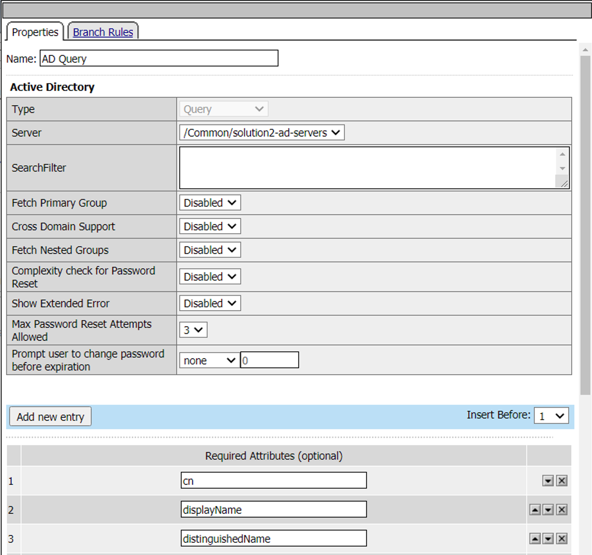
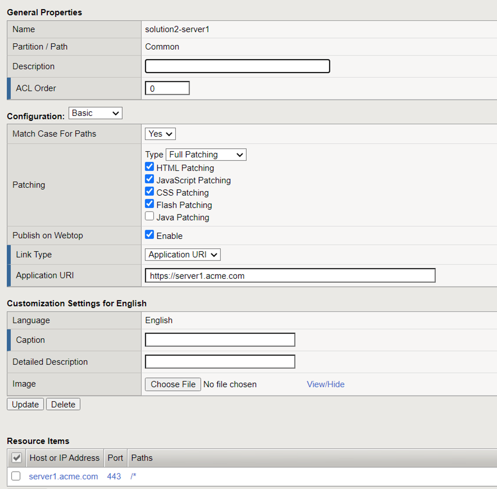

The Policy
======================================================

Policy Walk-Through
----------------------

|image001|  

1. In this policy a user enters their credentials in the logon page agent.  
  - Those credentials are collected, stored as the default system session variables of session.logon.last.username and session.logon.last.password.                                
  - The user proceeds down the logon page fallback branch to the AD Auth Agent              
2. The AD Auth Agent validates the the username and password session variables against the configured AD Domain Controller.
3. If AD Authentication is successful, the user proceeds down the Successful Branch
    - The AD Query Agent connects to the AD Server to retrieve user attributes (Specificially memberOf)
4. If query succeeds, the user is assigned resourced defined in the AD Group Resource Assign
5. The user is granted access via the Allow Terminal
6. If the AD query fails,  the user is denied access via the Deny Terminal
7. If AD Authentication is unsuccessful, the user proceeds down the failback branch to the Deny Terminal
                                       

                                                                                    

Policy Agent Configuration
----------------------------

The Logon Page contains only the default setting                                                                          

|image002|                                                                                   

The AD Auth Agent uses a defined the  AD AAA Server object that user will be authenticated against.  All Setting are the default.

|image003|     

The AD Query Agent uses the default settings to look for a sAMAccountName that matches  the session variable session.logon.last.username.  

|image004|

If a match is found the attributes specified in the  Required Attributes section are requested by APM and are returned by Active Directory

|image005|                                                                            

The AD Group Resource Assign Agent grants user's access to resources according to their groups.  

:: note.  If a user is a member of more than one group the resources assigned are cumulative.                                     

|image006|                                                                                   

Supporting APM Objects
-----------------------

Network Access Resource
^^^^^^^^^^^^^^^^^^^^^^^^

The Properties page contains the Caption name **VPN**.  This is the name displayed to a user                            

|image007|                                                                                   

- The Network Settings tab assigns the **lease pool** of ip addresses that will be used for the VPN                         
- Split Tunneling is configured to permit only the **10.1.20.0/24** subnet range inside the VPN                            
|image008|                                                                                   

Lease Pool
^^^^^^^^^^^^
A single address of **10.1.20.254** is assigned inside the lease pool.                                                    

|image009|                                                                                   

Webtop
^^^^^^^^^^^
- A Full Webtop was defined with modified default settings.                                  
- The Minimize to Tray box was checked to ensure when a user connects to the VPN the Webtop is not displayed               

|image010|  

Webtop Sections
^^^^^^^^^^^^^^^^
A single section is configured to display a custom name.                                                                  

|image011|                                                                                   

Portal Access Resources
^^^^^^^^^^^^^^^^^^^^^^^^^^

- The **Application URI** field contains the URL of the resource

|image012|

- Destination field contains the hostname of the application
- Path is set to /* for all paths
- The port is set to 443

|image013|

                                                                                 

The Policy from a user's perspective
-------------------------------------

User1
^^^^^^

#. User1 is presented a logon page to collect AD credentials

   |image014|

#. User1 is presented resources based on their **Sales Engineering** group membership

   |image015|

User2
^^^^^^

#. User2 is presented a logon page to collect AD Credentials

   |image016|

#. Uesr2 is presented resources based on the **Product Management** group membership

   |image017|

.. |image002| image:: media/002.png

.. |image009| image:: media/009.png

.. |image014| image:: media/014.png

   

