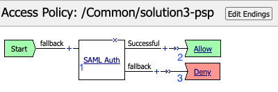
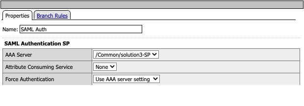
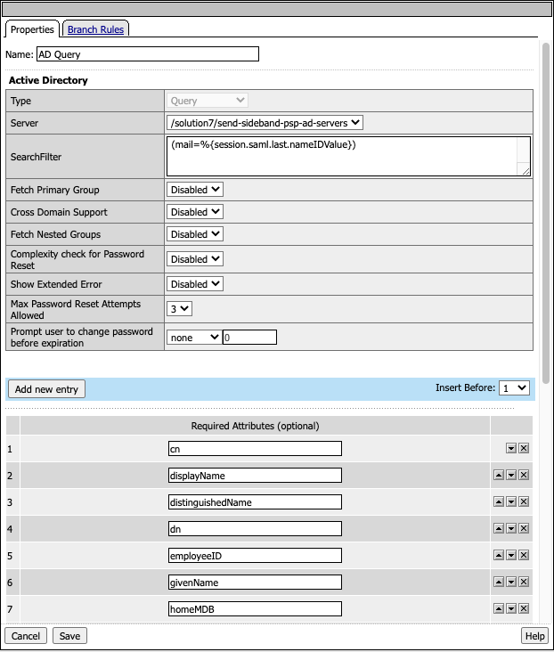
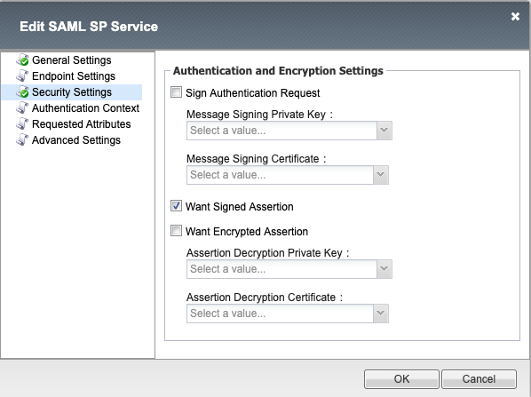
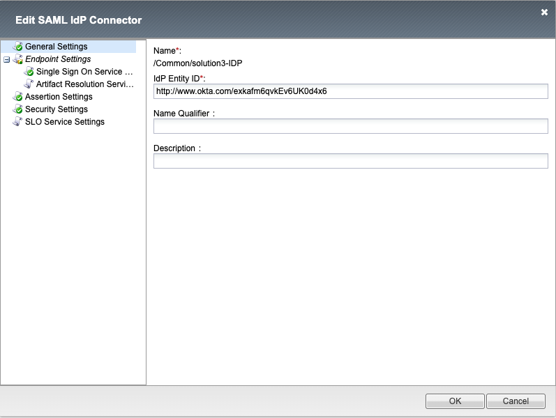
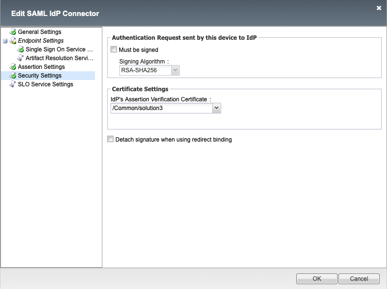
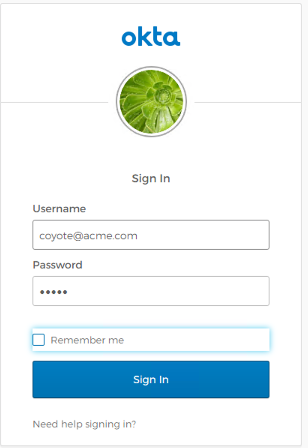
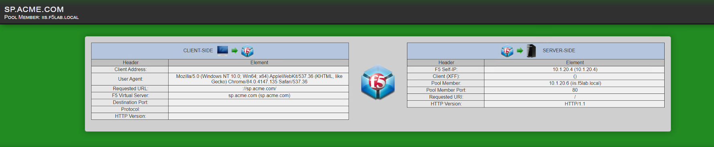

The Policy
=============

Policy Walk-Through
----------------------

|image001|     

1. When a user accesses a VIP protected by this policy they are redirected to the IDP selected by the SP Service.         
2. Upon successful authentication at the IDP, the user is redirected back to the SP.  The SP service consumes the Assertion.  The user is granted access via the Allow Terminal 
3. Upon unsuccessful authentication, the user proceeds down the fallback branch and denied access via the Deny Terminal
                                       
                                                                             

Policy Agent Configuration
----------------------------

The SAML Auth Policy Item contains the following settings                                                                         

|image002|                                                                                   

                                                                                

Profile Settings
-------------------

All profile settings are left the defaults

                                                                          

Supporting APM Objects
-----------------------
                                                                             

SP Service
^^^^^^^^^^^^
                                                   
Sections not specified contain default values

**General Settings**

|image003|

**Security Settings**

|image004|

                                                                             

IDP Connector
^^^^^^^^^^^^^^^^

Sections not specified contain default values

**General Settings**

|image005|

**Single Sign On Service**
                                                             
|image006| 

**Security Settings**

|image007|

                                                                              

The Policy from a user's perspective
-------------------------------------

If a user attempts to access https://sp.acme.com they will be redirected to its IDP(Okta) for authentication. 

 - Username: coyote@acme.com
 - Password: user1

|image008|

Once authenticated the user will be redirect back to the application and granted access

|image009|

.. |image006| image:: media/006.png

   

