Solution4 Policy
======================================================

Policy Walk-Through
----------------------

|image1|

#.  A user enters their credentials in the logon page agent.

    - Those credentials are collected, stored as the default system session variables of session.logon.last.username and session.logon.last.password.

#.  The AD Auth Agent validates the username and password session variables against the configured AD Domain Controller.
#.  The user is granted access via the Allow Terminal
#.  If unsuccessful, the user proceeds down the fallback branch and denied access via the Deny Terminal

Policy Agent Configuration
----------------------------

The Logon Page contains only the default setting

|image2|

The AD Auth agent defines the AAA AD Servers that a user will be authenticated against.  All Setting are the default.

|image3|

Profile Settings
-------------------

The SSO/Auth Domains setting was modified from its default to include the idp.acme.com SAML IDP Service

|image4|

Supporting APM Objects
-----------------------

AAA AD Servers
^^^^^^^^^^^^^^^^^

A single domain controller was configured for Active directory AAA authentication

|image5|

IDP Service
^^^^^^^^^^^^

The settings below define all the components of the IDP Service

**General Settings**

|image6|

**SAML Profile**

|image7|

**Endpoint Settings**

|image8|

**Assertion Settings**

|image9|

**SAML Attributes**

|image10|

**Security Settings**

|image11|

SP Connector
^^^^^^^^^^^^^^^^

The settings below define all the components of the SP Service

**General Settings**

|image12|

**Endpoint Settings**

|image13|

**Security Settings**

|image14|

**SLO Service Settings**

|image15|

**SP Location Settings**

|image16|

The Policy from a user's perspective
-------------------------------------

If the user attempts to access https://idp.acme.com they will be redirected to a logon page.  This solution is designed to be integrated with the solutions in the UDF deployment that require an IDP.

|image17|

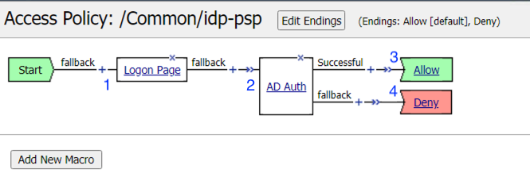
.. |image2| image:: media/002.png
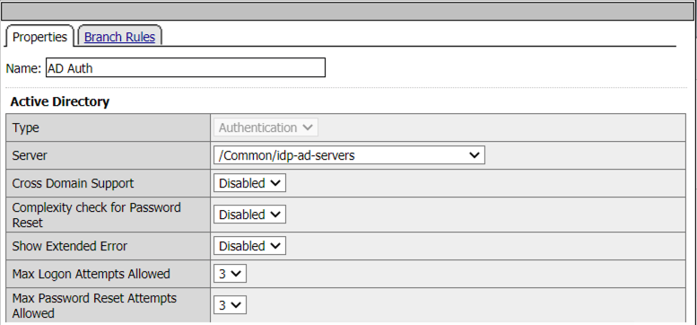
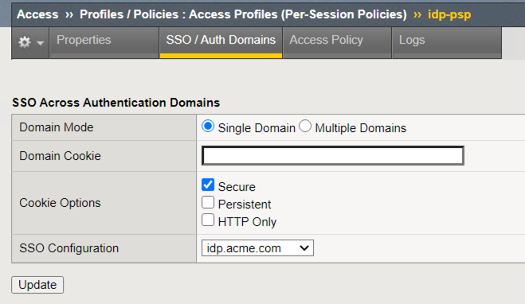
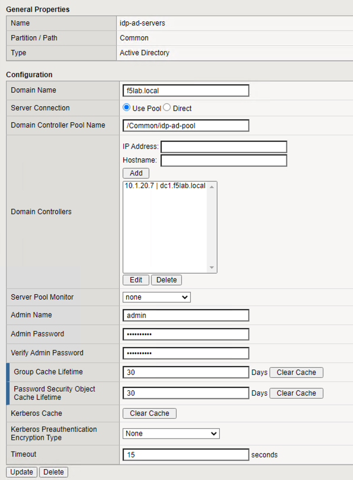
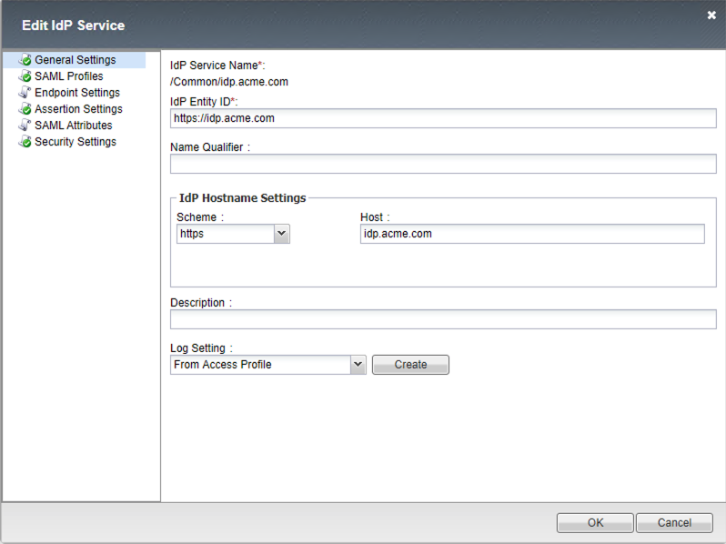
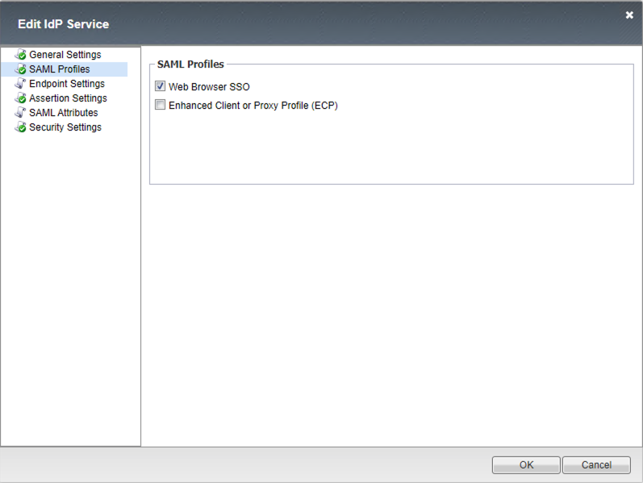
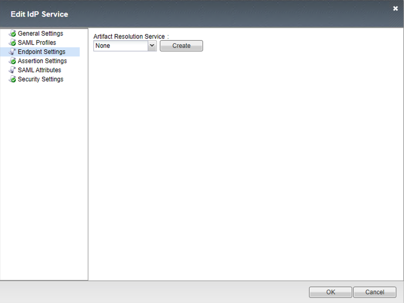
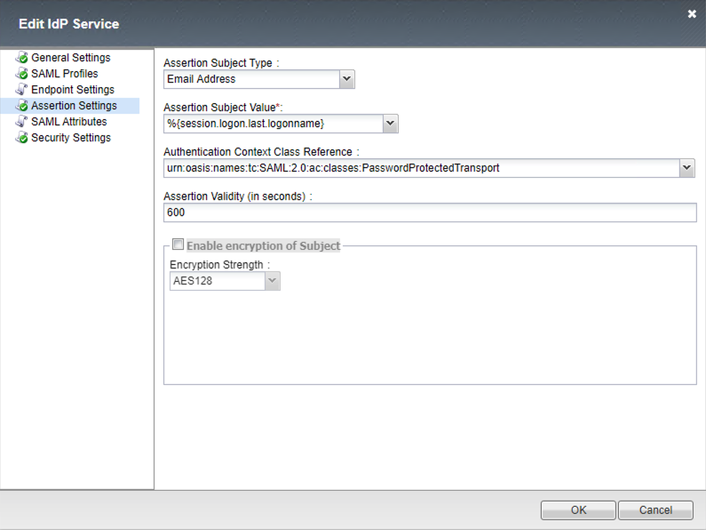
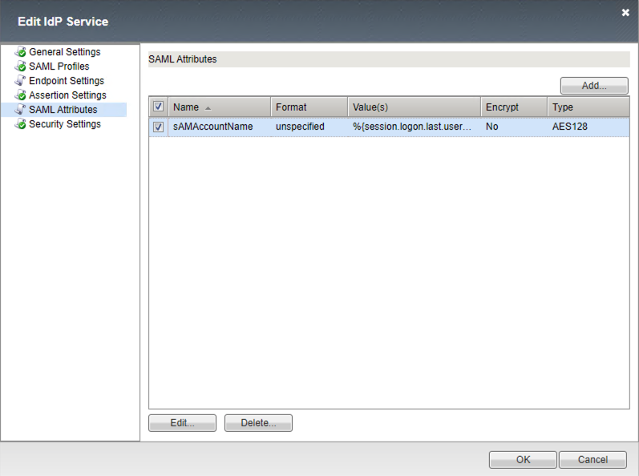
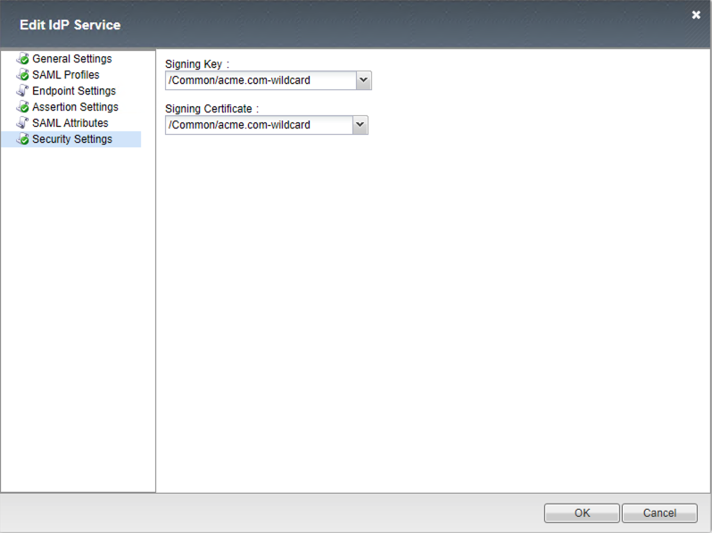
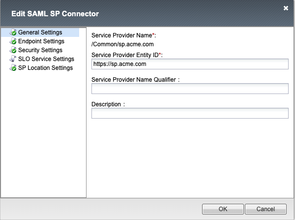
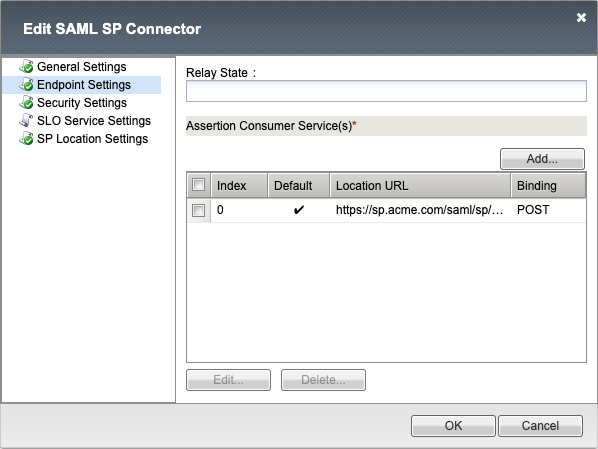
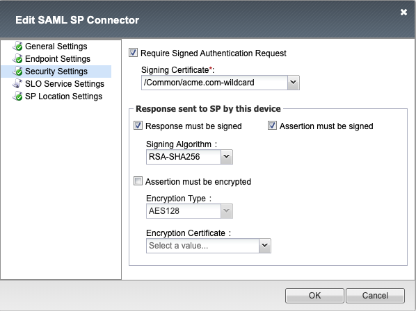
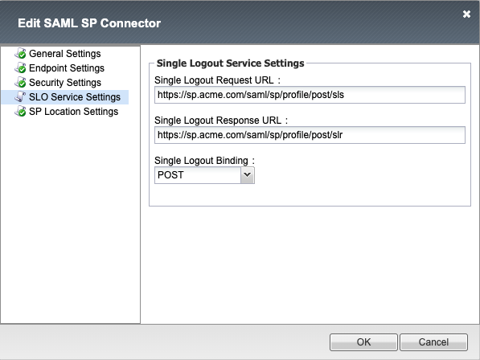
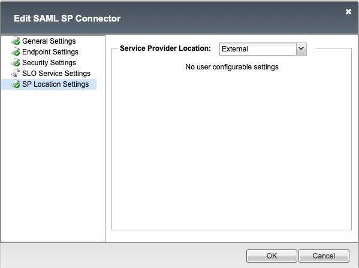
.. |image17| image:: media/017.png
