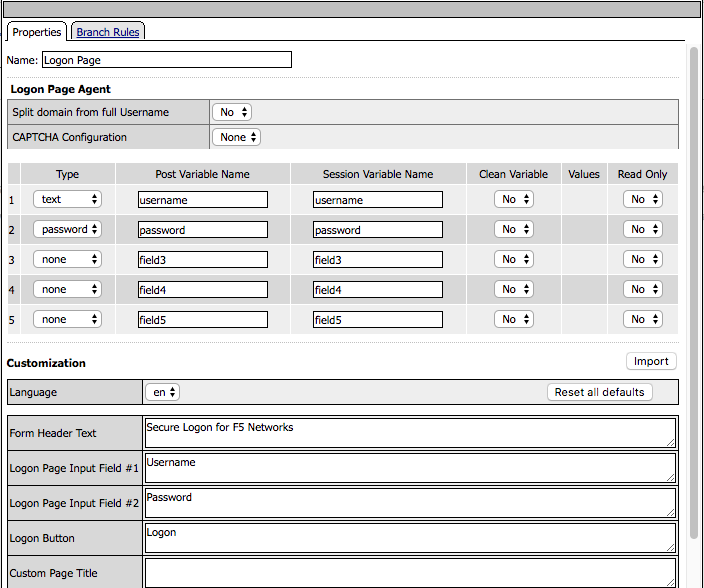
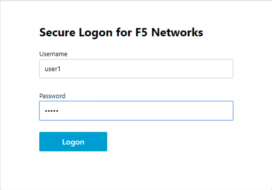

The Policy
======================================================

Policy Walk-Through
----------------------

|image001|     

1. In this policy a user enters their credentials in the logon page agent.  
    - Those credentials are collected, stored as the default system session variables of session.logon.last.username and session.logon.last.password.                                
          
2. The AD Auth Agent validates the the username and password session variables against the configured AD Domain Controller.
3. The user is granted access via the Allow Terminal
4. If unsuccessful, the user proceeds down the fallback branch and denied access via the Deny Terminal
                                       
                                                                             

Policy Agent Configuration
----------------------------

The Logon Page contains only the default setting                                                                          

|image002|                                                                                   

The AD Auth Agent uses a defined the  AD AAA Server object that user will be authenticated against.  All Setting are the default.

|image003|                                                                                   

Profile Settings
-------------------

|image004|

                                                                           

Supporting APM Objects
-----------------------

AAA AD Servers
^^^^^^^^^^^^^^^^^
The Properties page contains the Caption name **VPN**.  This is the name displayed to a user                            

|image005|                                                                                   

IDP Service
^^^^^^^^^^^^
A single address of **10.1.20.254** is assigned inside the lease pool.                                                    

**General Settings**

|image006|

**SAML Profile**

|image007|

**Endpoint Settings**

|image008|

**Assertion Settings**

|image009|

**SAML Attributes**

|image010|

**Security Settings**

|image011|

                                                                             

SP Connector
^^^^^^^^^^^^^^^^

**General Settings**

|image012|

**Endpoint Settings**
                                                             
|image013| 

**Security Settings**

|image014|

**SLO Service Settings**

|image015|

**SP Location Settings**

|image016|                                                                                  

The Policy from a user's perspective
-------------------------------------

|image017|

.. |image003| image:: media/003.png

.. |image006| image:: media/006.png
.. |image007| image:: media/007.png
.. |image008| image:: media/008.png
.. |image009| image:: media/009.png
.. |image010| image:: media/010.png
.. |image011| image:: media/011.png

.. |image014| image:: media/014.png
.. |image015| image:: media/015.png

   

