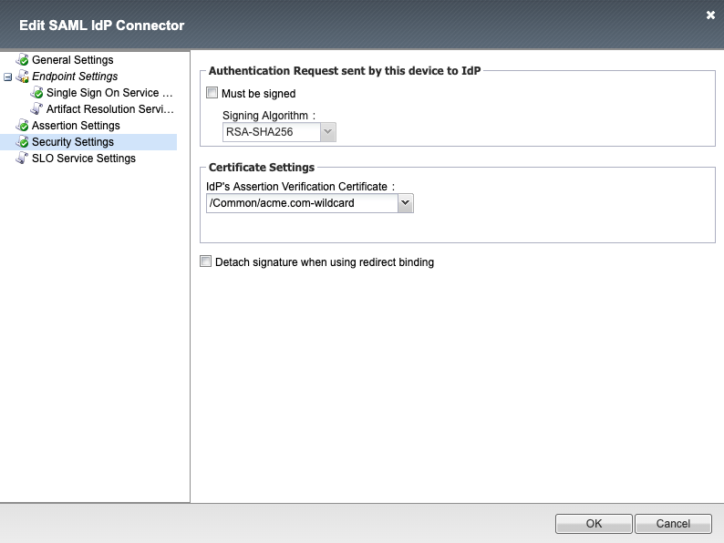

Solution 5 Policy
==========================

Policy Walk-Through
----------------------

|image1|

#.  A user accesses a VIP protected by this policy they are redirected to the IDP provider Selected by the SP Service.
#.  Upon successful authentication at the IDP, the IDP redirects the user back to the SP.  The SP service consumes the Assertion.  The user is granted access via the Allow Terminal
#.  If unsuccessful, the user proceeds down the fallback branch and denied access via the Deny Terminal

Policy Agent Configuration
----------------------------

The SAML Auth Policy Item contains the following settings

|image14|

Profile Settings
-------------------

All profile settings are left the defaults

Supporting APM Objects
-----------------------

SP Service
^^^^^^^^^^^^

The settings below define all the components of the SP Service

**General Settings**

|image2|

**Endpoint Settings**

|image3|

**Security Settings**

|image4|

**Authentication Context**

|image5|

**Requested Attributes**

|image6|

**Advanced Settings**

|image7|

IDP Connector
^^^^^^^^^^^^^^^^

The settings below define all the components of the IDP Connector

**General Settings**

|image8|

**Single Sign On Service**

|image9|

**Artifact Resolution Service**

|image10|

**Assertion Settings**

|image11|

**Security Settings**

|image12|

**SLO Service Settings**

|image13|

The Policy from a user's perspective
-------------------------------------

If the user attempts to access https://sp.acme.com they will be redirected to https://idp.acme.com  This solution is designed to be integrated with IDP solutions deployed in the UDF Deployment

**Supported IDP Solutions**

.. toctree::
   :maxdepth: 1
   :caption: Content:
   :glob:

   solution4/guide/guide.rst

|image15|

.. |image1| image:: media/001.png
.. |image2| image:: media/002.png

.. |image7| image:: media/007.png

.. |image9| image:: media/009.png
.. |image10| image:: media/010.png

.. |image14| image:: media/014.png

