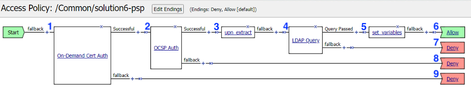
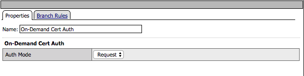
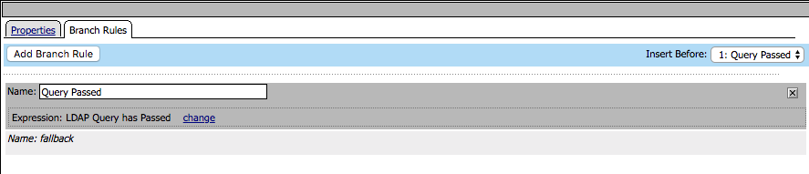

Solution 6 Policy
======================================================

Policy Walk-Through
----------------------

|image1|

#.  A user is prompted to select their certificate.

    - The validation of the user certificates is controlled via CA bundles selected in the Client-side SSL Profile.

#.  The certificate is validated by OCSP if the user presents a certificate issued by a trusted CA
#.  The othername field is extracted from the certificate
#.  A LDAP query is performed to collect the sAMAccountName of the user
#.  The domain and username variables are set
#.  The user is granted access via the Allow Terminal
#.  If the LDAP Query is unsuccessful, the user proceeds down the fallback branch to the Deny Terminal
#.  If the OCSP check is unsuccessful, the user proceeds down the fallback branch to the Deny Terminal
#.  If the user fails to present a certificate, the user proceeds down the fallback branch to the Deny Terminal

Policy Agent Configuration
----------------------------

- The On-Demand Cert Auth Agent uses the default settings

|image2|

- The OCSP Agent validates the certificate against the OCSP responder configured

|image3|

- The othername field is extracted from the certificate and saved as session variable session.logon.upn

|image4|

.. code-block:: text

  	session.custom.upn = set x509e_fields [split [mcget {session.ssl.cert.x509extension}] "\n"];
	# For each element in the list:
	foreach field $x509e_fields {
	# If the element contains UPN:
	if { $field contains "othername:UPN" } {
	## set start of UPN variable
	set start [expr {[string first "othername:UPN<" $field] +14}]
	# UPN format is <user@domain>
	# Return the UPN, by finding the index of opening and closing brackets, then use string range to get everything between.
	return [string range $field $start [expr { [string first ">" $field $start] - 1 } ] ];  } }
	#Otherwise return UPN Not Found:
	return "UPN-NOT-FOUND";

- The LDAP query connects to the LDAP server to the dc=f5lab,dc=local DN for a user that contains the userPrincipalName matching the value stored in session.custom.upn
- The LDAP query requests the sAMAccountName attribute if the user is found

|image5|

- The branch rule was modified to only require a LDAP Query passed condition

|image6|

- Two session variables are set

  * session.logon.last.username is populated with the value of the sAMAccountName returned in the LDAP Query
  * session.logon.last.domain is populated with a static value for the Active Directory domain F5LAB.LOCAL

|image7|

Customized LTM Profile settings
---------------------------------

- The Client-side SSL profile Client Authentication section has been modified to support certificate authentication

  * Trusted Certificate Authorities has been set to ca.f5lab.local

    - The bundle validates client certificates by these issuers
    - The bundle must include all CAs in the chain

  * Advertised Certificate Authorities has ben set to ca.f5lab.local

    - The bundle controls which certificates are displayed to a user when they are prompted to select their certificate 

|image8|

Customized APM Profile Settings
----------------------------------

- The SSO/Auth Domains of the APM profile is configured with the Kerberos SSO Profile needed to authenticate to the server.

|image9|

Supporting APM Objects
-----------------------

AAA OCSP Responder
^^^^^^^^^^^^^^^^^^^^^^^^

The OCSP Responder has been configured with the following settings

- URL: this field is only used if you check the Ignore AIA field
- Certificate Authority File:  contains the root ca bundle
- Certificate Authority Path:  this field is only used if you check the Ignore AIA field

|image10|

AAA LDAP Object
^^^^^^^^^^^^^^^^^^

A single LDAP server of 10.1.20.7 has been configured with a admin service account to support queries

|image11|

Kerberos SSO Object
^^^^^^^^^^^^^^^^^^^^^

- The Username Source field has been modified from the default to reference the sAMAccountName stored in session.logon.last.username
- Kerberos Realm has been set to the Active Directory domain (realms should always be in uppercase)
- The service account used for Kerberos Constrained Delegation (Service Account Names should be in SPN format)
- SPN Pattern has been hardcoded to HTTP/solution6.acme.com (This is only necessary if the SPN doesn't match the FQDN typed in the web browser by the user)

|image14|

The Policy from a user's perspective
-------------------------------------

User1
^^^^^^

#. User1 is prompted to select their certificate

   |image12|

#. If successful the user is granted access to the application

   |image13|

.. |image15| image:: media/015.png
.. |image16| image:: media/016.png
.. |image17| image:: media/017.png
