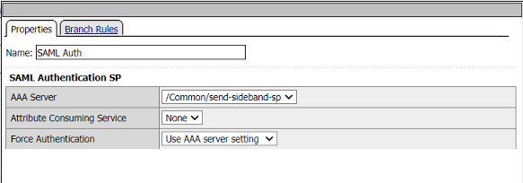
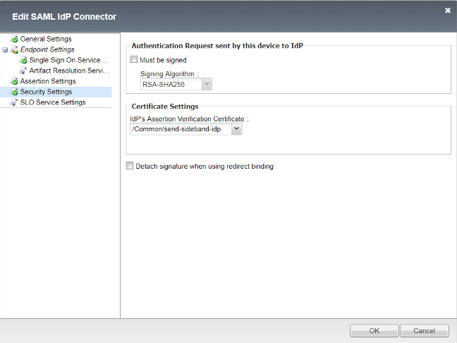
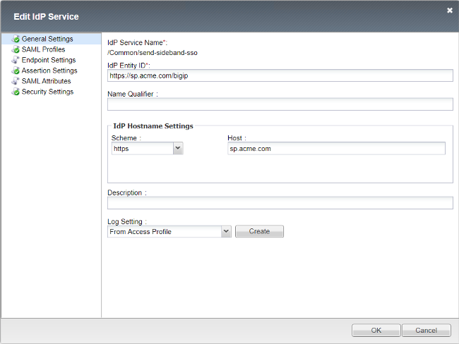
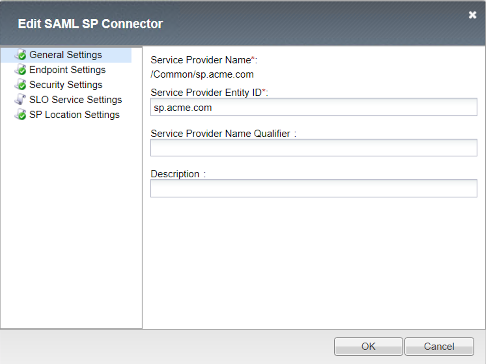
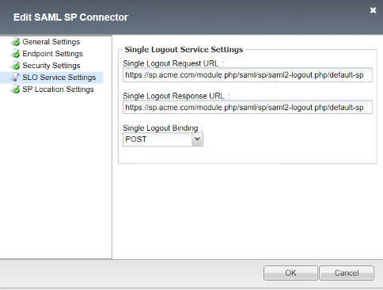
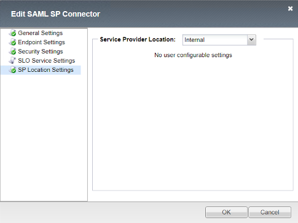
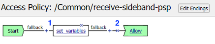
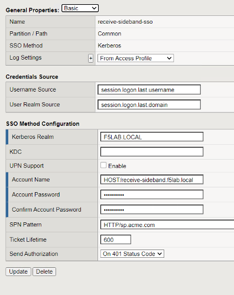

Traffic Flow
======================

|image025|

Send-Sideband Policy
===========================

Policy Walk-Through
-------------------------------------

|image001|  

1. A user is redirect to the external SAML IDP 
  - Once authenticated at the IDP the user is redirected back to the BIG-IP.                                            
2. If the SAML assertion is valid an AD Query is performed to match the email address in the assertion to an AD Account.
  -  The attribute sAMAccountName is returned to be used in the send-sideband irule
3. The session variable session.logon.last.user is set from the SAML Assertion NameIDAttribute session.saml.last.nameIDValue
4. iRule Event send-sideband is triggered
5. The user is granted access via the Allow Terminal
6. If the LDAP Query is unsuccessful, the user proceeds down the fallback branch to the Deny Terminal
7. If the SAML Auth is unsuccessful, the user proceeds down the fallback branch to the Deny Terminal

                                       

                                                                                  

Policy Agent Configuration
----------------------------

- The SAML Auth Agent selected the SP service to be used.  This selection indirectly selects the IDP to be used.                                                                   

   |image002|                                                                                   

- The AD Query Agent validates the email address(username) specified in the SAML nameID attribute exists in Active Directory

   |image003|     

- The SAML nameID attribute is passed to the username attribute

  |image004|

- The irule event triggers the send-sideband request

   |image005|                                                                            

        
Customized APM Profile Settings
----------------------------------

- The APM Profiles SSO Configurtion section has the BIG-IP SAML IDP service selected.

|image006| 

                                                                               
Send Side-band irule
---------------------------------
::

 when ACCESS_POLICY_AGENT_EVENT {
	switch -glob [string tolower [ACCESS::policy agent_id]] {
		"send-sideband" {
			#established a TCP based sideband connetion to virtual server receive-sideband
			set conn [connect -protocol TCP -timeout 100 -idle 30 -status conn_status /solution7/receive-sideband/receive-sideband]
			#converts the APM session variable to a TCL variable
			#sends a HTTP requrest over the sideband with the username in a query string
			set username [ACCESS::session data get "session.ad.last.attr.sAMAccountName"]
			set data "GET /?username=$username HTTP/1.1\r\nHost: sp.acme.com\r\nUser-Agent: Side-band\r\nclientless-mode: 1\r\n\r\n"
			set send_info [send -timeout 3000 -status send_status $conn $data]
			# waits 1 second and then closes the connection
			after 1000
			close $conn
                 }
        }
  }  

Supporting APM Objects
-----------------------

SP Service
^^^^^^^^^^^^

**General Settings**

SP Service sections not displayed contain default values

- Entity ID: https://sp.acme.com
- Host:      sp.acme.com                     

|image007|                                                                                   

**Security Settings**

- Want Signed Assertion is **checked**

|image008|

                                                                               
IDP Connector
^^^^^^^^^^^^^^^

**General Settings**

- Okta's Entity ID

|image009|

**Single Sign On Service URL**

- Okta's SSO Service URL

|image010|

**Security Settings**

- Okta's IDP Certificate selected

                                          
|image011|    

IDP Service
^^^^^^^^^^^^

**General Settings**

- IDP Entity ID: https://sp.acme.com/bigip
- Host:    sp.acme.com

|image012|

**Assertion Settings**

- Assertion Subject Type: Transient Identifier
- Assertion Subject Value: %{session.logon.last.username}

|image013|

**Security Settings**

|image014|

SP Connector
^^^^^^^^^^^^^

**General Settings**

|image015|

**Security Settings**

|image016|

**SLO Service Settings**

|image017|

**SP Location Settings**

This setting determines whether the client has direct access to the BIG-IP IDP.  

Selecting Internal causes the BIG-IP to trigger an SSO action and POST a SAML Assertion to the application on behalf of the user. 

The user will only have access to the external IDP Assertion and not any assertions from the BIG-IP IDP when internal is selected.

Service Provider Location:  Internal

|image018|

AAA Active Directory
^^^^^^^^^^^^^^^^^^^^^^^

|image019|

Receive-Sideband Policy
===========================

                                                                             
Policy Walk-Through
-------------------------------------

|image020|

1. The session variable session.logon.last.domain is set to the AD Domain f5lab.local
2. The sideband request is granted access via the Allow Terminal

Customized APM Profile Settings
----------------------------------

- The SSO/Auth Domains of the APM profile is configured with the Kerberos SSO Profile needed to authenticate to the server.

|image021|

Send Side-band irule
---------------------------
::

 when CLIENT_ACCEPTED {
  ACCESS::restrict_irule_events disable
   }
 when HTTP_REQUEST {
  #Parses query string and splits the first parameter name from the value.
  #The value is stored as the username variable
  set username [lindex [split [HTTP::query] =] 1]
  }
 when ACCESS_SESSION_STARTED {
  #Stores the tcl username variable as a session variable
  ACCESS::session data set session.logon.last.username $username
  }  
	

Supporting APM Objects
-----------------------

Kerberos SSO
^^^^^^^^^^^^^^

|image022|

User's Perspective
---------------------

#. A user connects to https://sp.acme.com and is redirect to the external IDP.
     
   - username: coyote@acme.com
   - Password: user1
    

   |image023|

#. After successful logon the user is granted access to the application

   |image024|

.. |image013| image:: media/013.png

   

