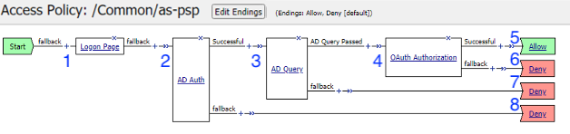
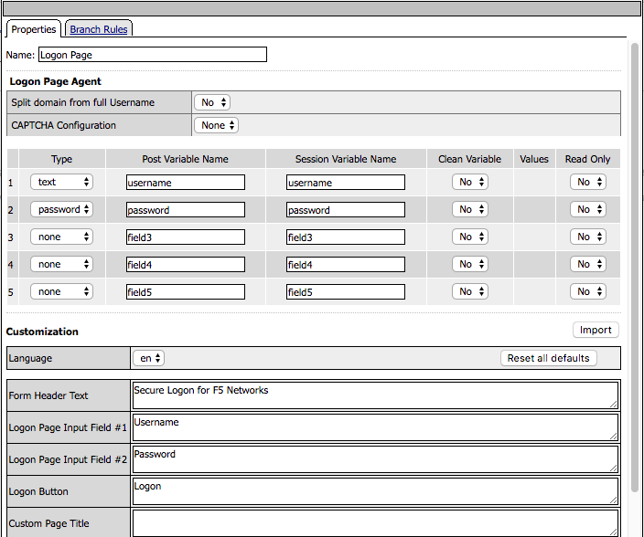
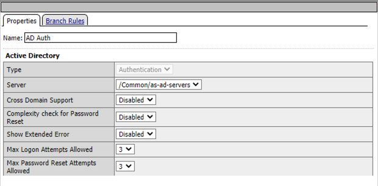
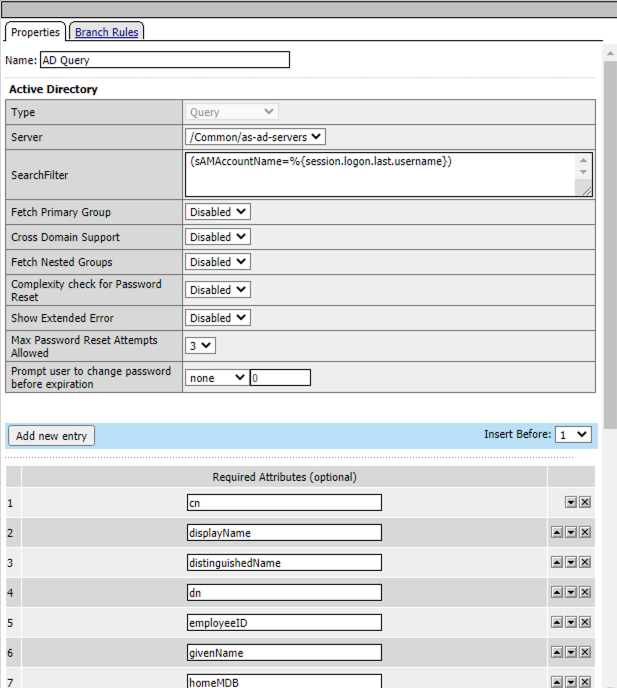
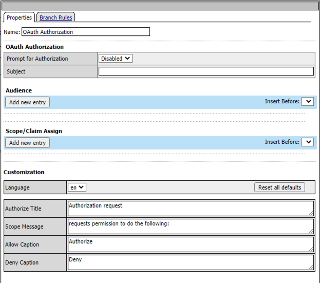
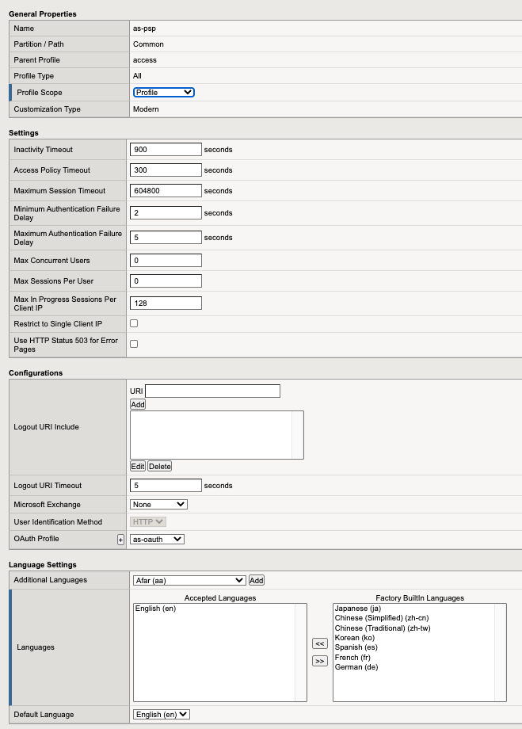
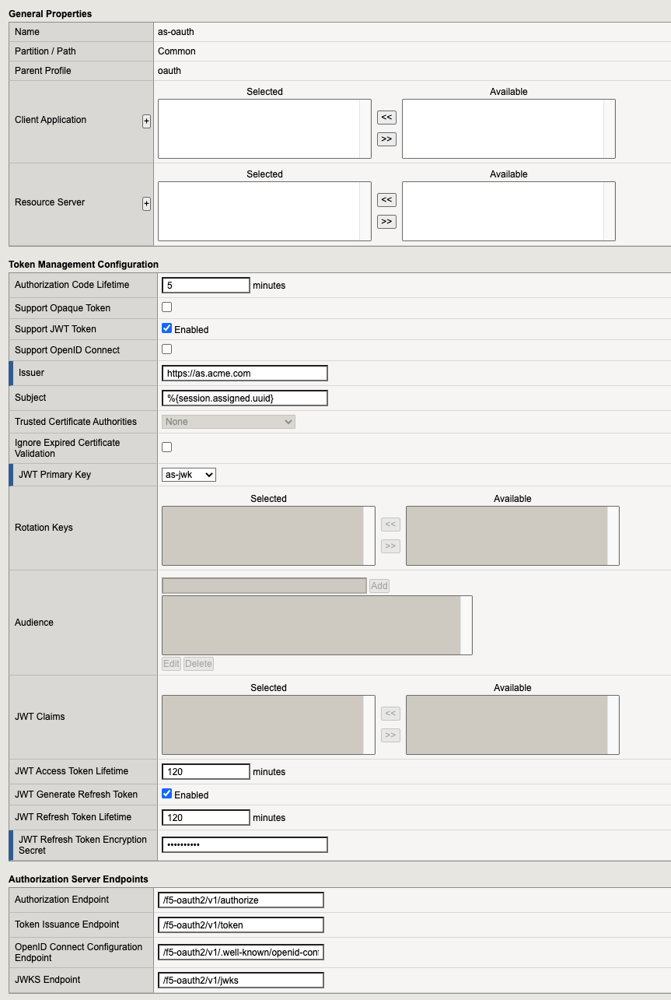
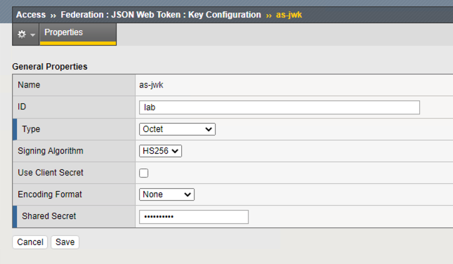
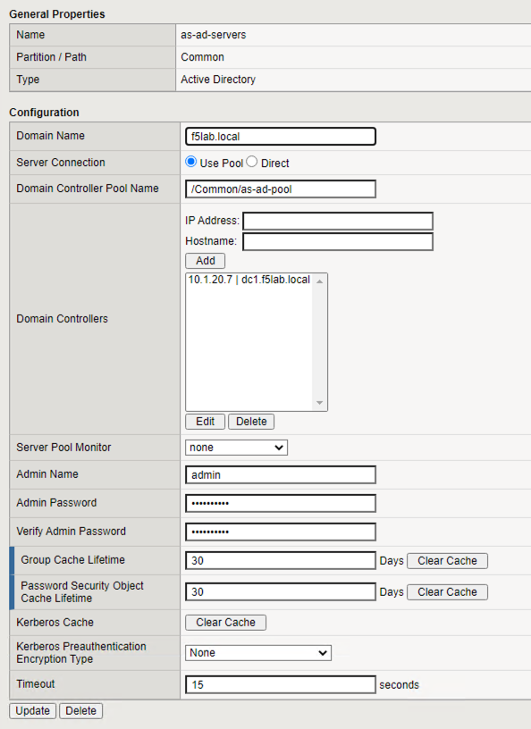
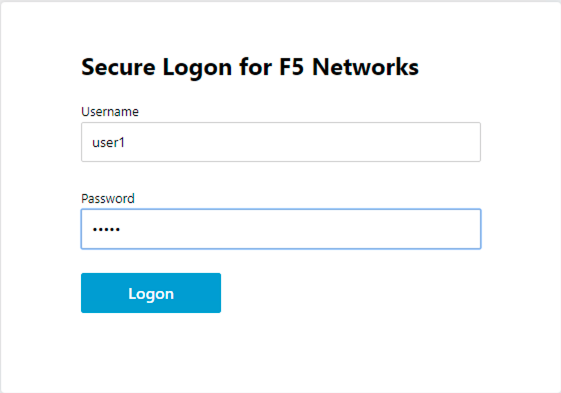

The Policy
======================================================

Policy Walk-Through
----------------------

|image001|     

1. In this policy a user enters their credentials in the logon page agent.  
    - Those credentials are collected, stored as the default system session variables of session.logon.last.username and session.logon.last.password.                                          
2. The AD Auth Agent validates the the username and password session variables against the configured AD Domain Controller.
3. If AD Auth is successful, an AD Query is performed to retrieve additional AD Attributes
4. If AD Query is successful, an OAuth Authorization is performed granting the user access to a token.
5. The user is granted access via the Allow Terminal
6. If unsuccessful, the user proceeds down the fallback branch and denied access via the Deny Terminal
7. If unsuccessful, the user proceeds down the fallback branch and denied access via the Deny Terminal
8. If unsuccessful, the user proceeds down the fallback branch and denied access via the Deny Terminal
                                       
                                                                             

Policy Agent Configuration
----------------------------

The Logon Page contains only the default setting                                                                          

|image002|                                                                                   

The AD Auth Agent uses a defined the  AD AAA Servers that user will be authenticated against.  All Setting are the default.

|image003|                                                                                  

The AD Query Agent uses a defined the  AD Servers that user will be for queries against.  Additional Attributes we added.

|image004|

The OAuth Authorization Agent is used to define the Audience and Scope.  All Setting are the default.

|image005| 
                                                                                   

Profile Settings
-------------------

The Oauth Profile used for issuing the JWT token is assigned under the Configuration section.

|image006|

                                                                         

Supporting APM Objects
-----------------------

                                                                              
OAuth Profile
^^^^^^^^^^^^^^
                                                   
The settings below define all the components of the OAuth Profile

|image007|

                                                                             

JWT Key
^^^^^^^^^^^^^^^^

|image008|

AAA AD Servers
^^^^^^^^^^^^^^

|image009|                                                                       

The Policy from a user's perspective
-------------------------------------

If the user attempts to access https://as.acme.com they will be redirected to a logon page.  This solution is designed to be integrated with other solutions in the UDF deployment that require an Authorization Server.

Supported Solutions
^^^^^^^^^^^^^^^^^^^^
 - Solution9

|image010|

.. |image011| image:: media/011.png
.. |image012| image:: media/012.png
.. |image013| image:: media/013.png
.. |image014| image:: media/014.png
.. |image015| image:: media/015.png

   

