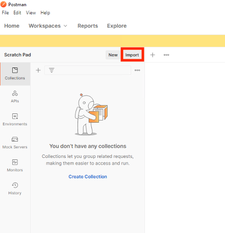

Solution9 Policy
======================================================

Policy Walk-Through
----------------------

|image001|

1. When a user accesses a VIP protected by this policy JWT and scope validation is performed
2. Upon successful Authorization, the user is granted access via the Allow Terminal
3. If unsuccessful, the user proceeds down the fallback branch and denied access via the Deny Terminal

Policy Agent Configuration
----------------------------

The OAuth Scope Settings are defined as Internal.

|image002|

Profile Settings
-------------------

All profile settings are left the defaults

Supporting APM Objects
-----------------------

Provider List
^^^^^^^^^^^^^^

The provider List defines a single provider

|image003|

Provider
^^^^^^^^^

The settings below define all the components of the Authorization Server's endpoints to retrieve and validate tokens.

|image004|

JSON Web Token
^^^^^^^^^^^^^^^

The JWT setting define the signing algorithms used by a provider with a set of jwks

|image005|

JWT Key
^^^^^^^^^^^^^^^^

The key settings define a type of key and its properties

|image006|

The Policy from a user's perspective
-------------------------------------

This solution is designed to be integrated with Authorization Server based solutions. Please ensure you deply the Authoriztion Server prior to deploying this solution.

#. Open **Postman** on the Jumphost
#. Click **Import**

    |image007|

#. Click **Upload Files**

    |image008|

#. Navigate to C:\\access-solutions\\solution9\\student_files, select solution9 request.json, and click Open

    |image009|

#. Click **Import**

    |image010|

 #. Expand the collection.
 #. Select **1. Retreive OAuth Client Settings**
 #. Click **Send**

    |image011|

#.  You will receive a response body containing the ClientId and ClientSecret.  This request saved those values as a Postman Variables.

    |image012|

#. Select **2. Sample API Request**
#. Click the **Authorization** tab.

    |image013|

#. Click **Get New Access Token** 

    |image014|

#. Login using Username: user1 and Password: user1   

    |image015|

#. Click **Use Token**

    |image016|

#. Click **Send**

    |image017|

#.  The user receives a 200 OK with a response.  The Access Token was successfully validated by the BIG-IP to permit access.

    |image018|

.. |image001| image:: media/001.png
.. |image002| image:: media/002.png

.. |image004| image:: media/004.png
.. |image005| image:: media/005.png
.. |image006| image:: media/006.png

.. |image004| image:: media/014.png

.. |image006| image:: media/016.png

